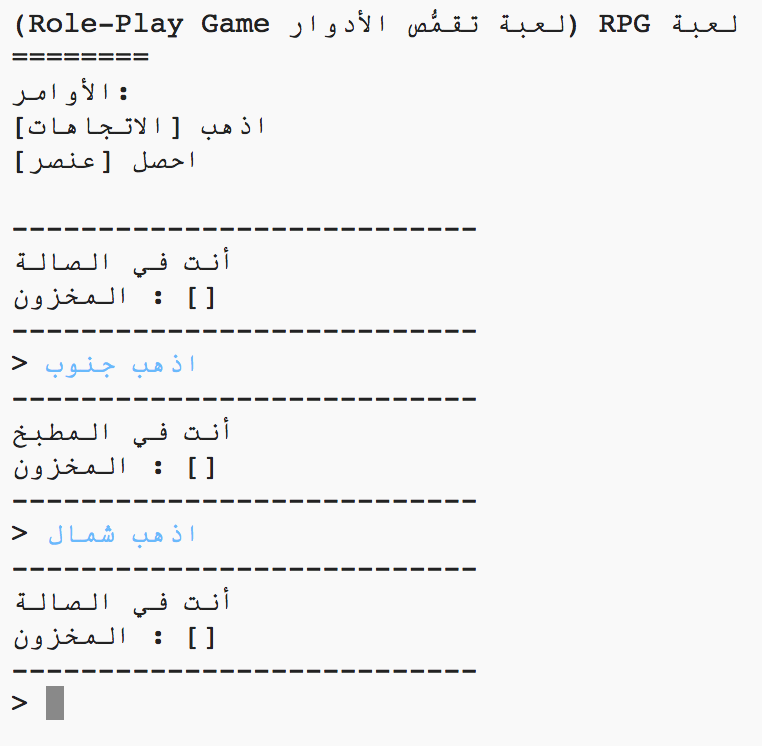
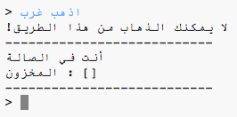
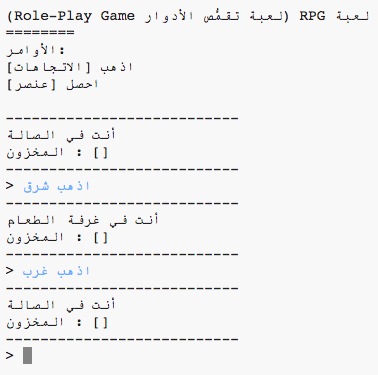

## إضافة غرف جديدة

\--- task \--- Open the Python starter project.

**متصل بالانترنت**: افتح مشروع البدء من هنا [rpf.io/rpgon](http://rpf.io/rpgon){:target="_blank"}.

**دون اتصال بالانترنت**: افتح [مشروع البدء](http://rpf.io/p/en/rpg-go){:target="_blank"} عبر المحرر الموجود على جهازك. \--- /task \---

\--- task \--- هذه لعبة RPG بسيطة جداً حيث تحتوي على غرفتين فقط. ها هي خريطة اللعبة:

يمكنك كتابة `اذهب جنوباً` للتحرك من الصالة إلى المطبخ، ومن ثم `اذهب شمال` للعودة إلى الصالة مجدداً!

 \--- /task \---

\--- task \--- ماذا يحدث عندما تكتب في إتجاه لا يمكنك الذهاب إليه؟ اكتب `اذهب غرب` من الصالة وستحصل على رسالة خطأ.

 \--- /task \---

\--- task \--- إذا عثرت على المتغيِّر `rooms` يمكنك ملاحظة أن الخريطة مبرمجة على هيئة قاموس من الغرفة:

## \--- code \---

## language: python

# قاموس يربط بين غرفة والغرف الأخرى

rooms = {

            'Hall' : {
                'south' : 'Kitchen'
            },
    
            'Kitchen' : {
                'north' : 'Hall'
            }
    
        }
    

\--- /code \---

كل غرفة عبارة عن قاموس، والغرف مرتبطة ببعضها البعض باستخدام الاتجاهات.  
\--- /task \---

\--- task \--- لنقم بإضافة غرفة الطعام لخريطتك، شرق الصالة.

تحتاج لغرفة ثالثة, تسمي `غرفة المعيشة`, وربطها بالصالة (في الشرق). ستحتاج أيضاً لإضافة بعض البيانات للصالة، حتى تستطيع التحرك إلى غرفة الطعام من الشرق.

**لا تنسي انك ايضاً تحتاج لإضافة فاصلة للسطر قبل أوامر برنامجك الجديد.**

## \--- code \---

language: python

## line_highlights: 5-6,11-15

# قاموس يربط بين غرفة والغرف الأخرى

rooms = {

            'Hall' : {
                'south' : 'Kitchen',
                'east' : 'Dining Room'
            },
    
            'Kitchen' : {
                'north' : 'Hall'
            },
    
            'Dining Room' : {
                'west' : 'Hall'
            }
    
        }
    

\--- /code \--- \--- /task \---

\--- task \--- جرب اللعبة مع غرفة الطعام الجديدة:

إذا لم تتمكن من الدخول و الخروج من غرفة الطعام ، فقط تحقق من أنك أضفت جميع الأكواد الواردة أعلاه (بما في ذلك الفواصل الإضافية إلى الأسطر أعلاه). \--- /task \---