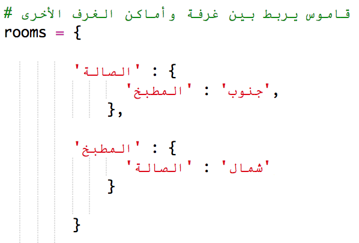
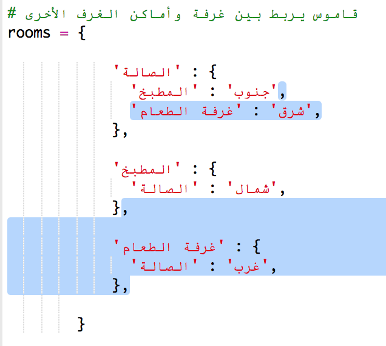

## إضافة غرف جديدة

+ بعض الأكواد لهذه اللعبة تم تقديمها لك. افتح مشروع trinket هذا: <a href="http://jumpto.cc/rpg-go" target="_blank">jumpto.cc/rpg-go</a>.

+ هذه لعبة RPG بسيطة جداً حيث تحتوي على غرفتين فقط. ها ذي خريطة اللعبة:
    
    
    
    يمكنك كتابة `اذهب جنوب` للتحرك من الصالة إلى المطبخ، ومن ثم `اذهب شمال` للعودة إلى الصالة مجدداً!
    
    

+ ماذا يحدث عندما تكتب في اتجاه أنك لا يمكنك الذهاب؟ اكتب `اذهب غرب` من الصالة وستحصل على رسالة خطأ ودودة.
    
    

+ إذا عثرت على المتغيِّر `rooms` يمكنك ملاحظة أن الخريطة مبرمجة على هيئة قاموس من الغرفة:
    
    
    
    كل غرفة عبارة عن قاموس والغرف مرتبطة ببعضها البعض باستخدام الاتجاهات.

+ لنقم بإضافة غرفة الطعام لخريطتك، شرق الصالة.
    
    
    
    تحتاج لإضافة غرفة ثالثة، تسمى `غرفة الطعام`. ستحتاج أيضاً لربطها بالصالة من الغرب. ستحتاج أيضاً لإضافة بعض البيانات للصالة، حتى تستطيع التحرك إلى غرفة الطعام من الشرق.
    
    

+ جرب اللعبة مع غرفة الطعام الجديدة الخاصة بك:
    
    
    
    إذا لم تتمكن من الدخول و الخروج من غرفة الطعام ، فقط تحقق من أنك أضفت جميع الأكواد الواردة أعلاه (بما في ذلك الفواصل الإضافية إلى الأسطر أعلاه).