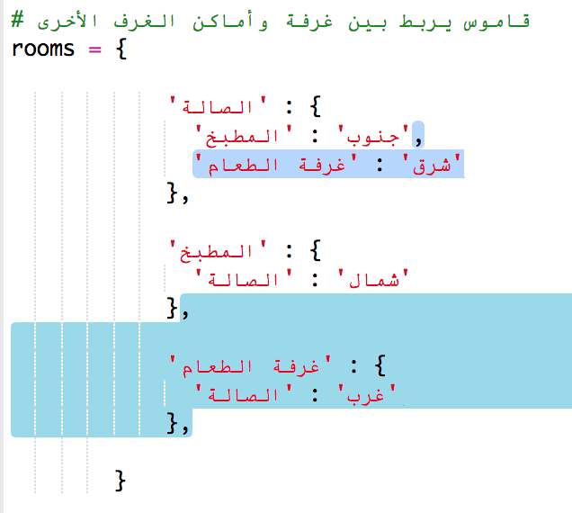

## إضافة غرف جديدة

+ تمت كتابة بعض التعليمات البرمجية لهذه اللعبة لمساعدتك. افتح مشروع trinket هذا: <a href="http://jumpto.cc/rpg-go" target="_blank">jumpto.cc/rpg-go</a>. 

+ هذه لعبة RPG بسيطة جدًا تحتوي على غرفتين فقط. موضح أدناه خريطة للعبة:

  

  يمكنك كتابة `go south` للتحرك من الصالة إلى المطبخ، ثم كتابة `go north` للعودة إلى الصالة مرة أخرى!

  

+ ماذا يحدث عندما تكتب اتجاهًا لا يمكنك الذهاب فيه؟ إذا كتبتَ `go west` عندما تكون في الصالة، فستظهر لك رسالة خطأ عادية.

  

+ إذا بحثتَ عن المتغير `rooms`، فسترى أن التعليمات البرمجية للخريطة عبارة عن قاموس غرف:

  

  كل غرفة عبارة عن قاموس وتتصل الغرف بعضها ببعض باستخدام الاتجاهات.  
  

+ لنضِف غرفة طعام إلى الخريطة، بحيث تكون شرق الصالة.

  

  ستحتاج إلى إضافة غرفة ثالثة تُسمى `dining room`. كما ستحتاج إلى ربطها بالصالة الموجودة غربها. وستحتاج أيضًا إلى إضافة بيانات إلى الصالة، بحيث يمكنك الانتقال إلى غرفة الطعام الموجودة شرقها.
  
  

+ جرِّب اللعبة بعد إضافة غرفة الطعام الجديدة:

  

  إذا لم تتمكن من دخول الغرفة والخروج منها، فتحقق من أنك أضفتَ كل التعليمات البرمجية أعلاه (وتحقق أيضًا من الفواصل الزائدة في الأسطر أعلاه).

