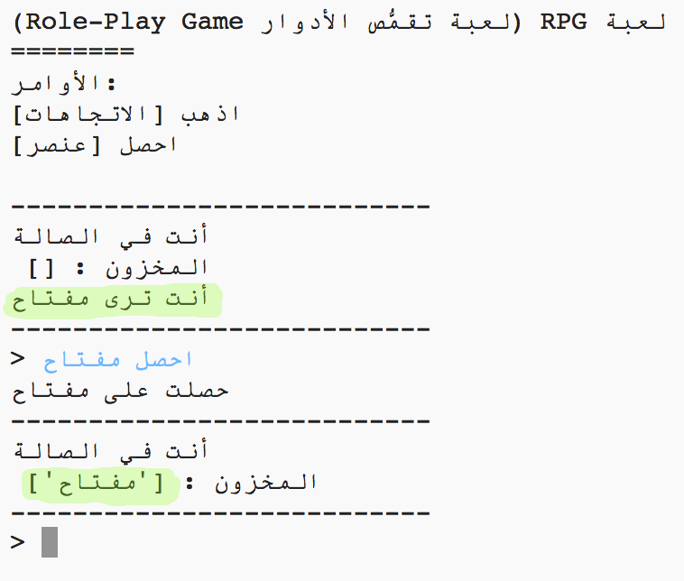

## إضافة عناصر لجمعها

لنترك بعض العناصر في الغرف للاعب حتى يقوم بجمعها أثناء تحركه خلال المتاهة.

\--- task \--- إضافة عنصر لغرفة هو أمر ٌسهل، يمكنك فقط إضافتها لقاموس الغرفة. لنضع مفتاحاً في الصالة.

تذكر وضع فاصلة بعد السطر أعلى العنصر الجديد ، وإلا فلن يعمل برنامجك!

## \--- code \---

language: python

## line_highlights: 6-7

# قاموس يربط بين غرفة والغرف الأخرى

rooms = {

            'الصالة' : {
                'جنوب' : 'المطبخ',
                'شرق' : 'غرفة الطعام',
                'عنصر' : 'مفتاح'
            },
    
            'المطبخ' : {
                'شمال' : 'الصالة'
            },
    
            'غرفة الطعام' : {
                'غرب' : 'الصالة'
            }
    
        }
    

\--- /code \---

\--- /task \---

\--- task \--- إذا قمت بتشغيل لعبتك بعد إضافة الكود أعلاه، يمكنك الآن رؤية مفتاح في الصالة، يمكنك حتى إلتقاطه (عن طريق كتابة `احصل مفتاح`) حيث ستقوم بإضافته إلى مخزونك!

 \--- /task \---