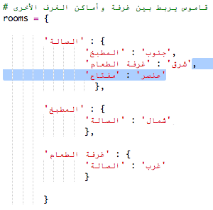

## إضافة أغراض لجمعها

لنضع أغراضًا في الغرف ليجمعها اللاعب أثناء تحركه في المتاهة.

+ إن إضافة الغرض داخل الغرفة عملية سهلة، فكل ما عليك هو إضافته إلى قاموس الغرفة. لنضع مفتاحًا في الصالة.

  

  تذكَّر أن تضع فاصلة بعد السطر الموجود أعلى الغرض الجديد، وإلا فلن تعمل هذه التعليمة البرمجية!

+ إذا قمتَ بتشغيل اللعبة بعد إضافة التعليمة البرمجية أعلاه، فسترى مفتاحًا في الصالة، ويمكنك أخذه أيضًا (بكتابة التعليمة البرمجية `get key`) التي تضيف المفتاح إلى القاموس!

    

