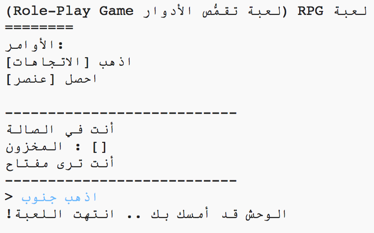

## إضافة أعداء

هذه اللعبة سهلة للغاية! لنقم بإضافة بعض الأعداء لبعض الغرف التي يجب على اللاعب تجنبها.

\--- task \--- إضافة عدو لغرفة سهل مثل إضافة أي عنصر آخر. لنقم بإضافة وحش جائع إلى المطبخ:

## \--- code \---

language: python

## line_highlights: 11-12

# قاموس يربط بين غرفة والغرف الأخرى

rooms = {

            'الصالة' : {
                'جنوب' : 'المطبخ',
                'شرق' : 'غرفة الطعام',
                'عنصر' : 'مفتاح'
            },
    
            'المطبخ' : {
                'شمال' : 'الصالة',
                'عنصر' : 'وحش'
            },
    
            'غرفة طعام' : {
                'غرب' : 'الصالة'
            }
    
        }
    

\--- /code \--- \--- /task \---

\--- task \--- تحتاج أيضاً للتأكد من أن اللعبة سوف تنتهي إذا دخل اللاعب غرفةً بها وحش. يمكنك فعل هذا بالكود التالي، الذي يجب عليك إضافته في آخر اللعبة:

## \--- code \---

language: python

## line_highlights: 6-9

        #غير ذلك، لو الغرض لم يكن هناك للحصول عليه
        else:
            #اخبرهم انهم لا يستطيعون الحصول عليه
            print('لايمكن الحصول على' + move[1] + '!')
    
    #يخسر اللاعب اذا دخل غرفة بها وحش
    if 'item' in rooms[currentRoom] and 'monster' in rooms[currentRoom]['item']:
        print('قضى عليك الوحش... إنتهت اللعبة!')
        break
    

\--- /code \---

هذا الكود يتحقق ما إذا كان هنالك عنصر في الغرفة، فاذا وجده، يتحقق ما إذا كان ذلك العنصر وحشاً. لاحظ أن هذا الكود مسبق بمسافة بادئة، بإضافتها في السطر مع الكود أعلاه. هذا يعني أن اللعبة ستتحقق من وجود وحش في كل مرة يقوم اللاعب بالتحرك إلى غرفة جديدة. \--- /task \---

\--- task \--- قم بتجربة الكود الخاص بك عن طريق الذهاب إلى المطبخ، و الذي يحتوي الآن على وحش.

 \--- /task \---