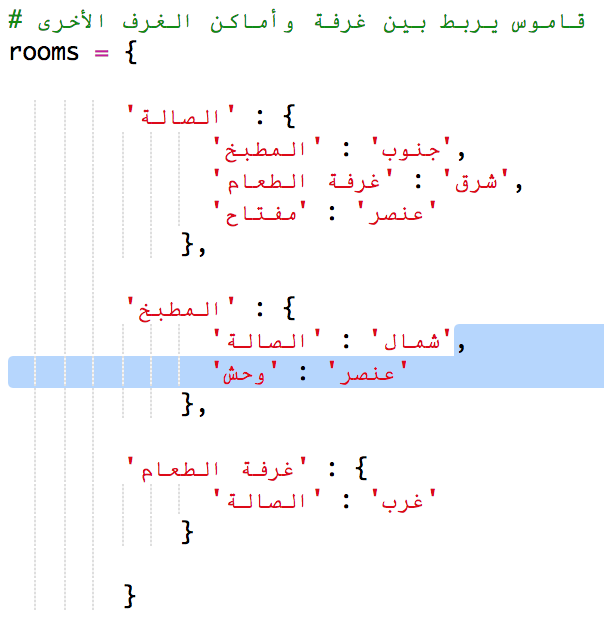
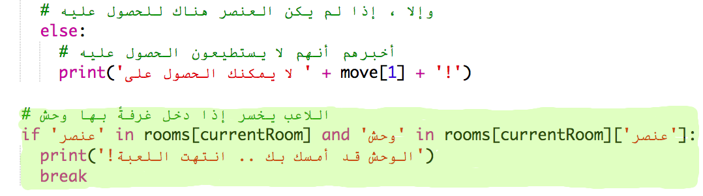

## إضافة أعداء

هذه اللعبة سهلة للغاية! لنقم بإضافة بعض الأعداء لبعض الغرف التي يجب على اللاعب تجنبها.

+ إضافة عدو لغرفة سهل كإضافة أي عنصر آخر. لنقم بإضافة وحش جائع إلى المطبخ:
    
    

+ تحتاج أيضاً التأكد من أن اللعبة تنتهي إذا دخل اللاعب غرفةً بها وحش. يمكنك فعل هذا بالكود التالي، الذي يجب عليك إضافته في آخر اللعبة:
    
    
    
    هذا الكود يتحقق ما إذا كان هنالك عنصر في الغرفة، وإذا كان كذلك، يتحقق ما إذا كان وحشاً. لاحظ أن هذا الكود مسبق بمسافة بادئة، بإضافتها في السطر مع الكود أعلاه. هذا يعني أن اللعبة ستتحقق من وجود وحش في كل مرة يقوم اللاعب بالتحرك إلى غرفة جديدة.

+ قم بتجربة الكود الخاص بك عن طريق الذهاب إلى المطبخ، و الذي يحتوي الآن على وحش.
    
    