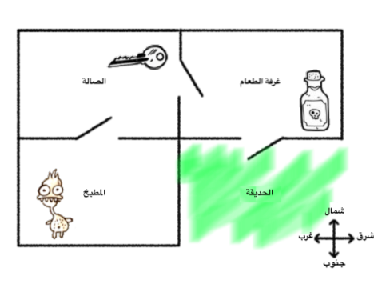
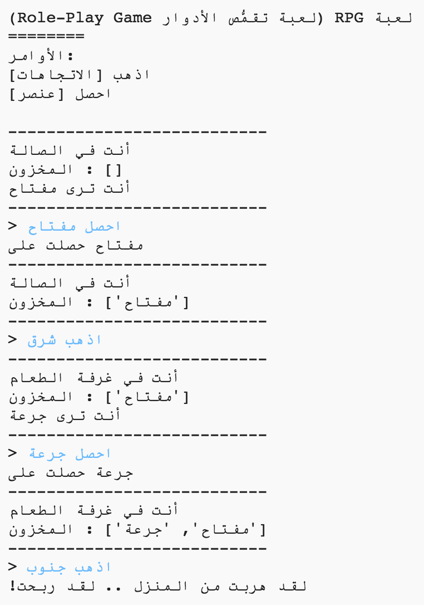
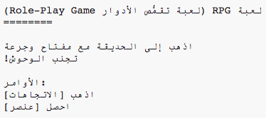

## الفوز في اللعبة

لنعطي لاعبك مهمة، حيث تحتاج أن تتم للفوز باللعبة.

\--- task \--- In this game, the player wins by getting to the garden and escaping the house. يجب عليهم أيضاً الحصول على المفتاح معهم، والجرعة السحرية. ها ذي خريطة اللعبة.

 \---/task--

\--- task \--- First, you need to add a garden to the south of the dining room. تذكر أن تضيف أبواباً ، لتربط بقية الغرف في المنزل.

## \--- code \---

language: python

## line_highlights: 16-17,18-22

# a dictionary linking a room to other rooms

rooms = {

            'Hall' : {
                'south' : 'Kitchen',
                'east' : 'Dining Room',
                'item' : 'key'
            },
    
            'Kitchen' : {
                'north' : 'Hall',
                'item' : 'monster'
            },
    
            'Dining Room' : {
                'west' : 'Hall',
                'south' : 'Garden'
            },
    
            'Garden' : {
                'north' : 'Dining Room'
            }
    
        }
    

\--- /code \--- \--- /task \---

\--- task \--- Add a potion to the dining room (or another room in your house).

## \--- code \---

language: python

## line_highlights: 3-4

            'Dining Room' : {
                'west' : 'Hall',
                'south' : 'Garden',
                'item' : 'potion'
            },
    

\--- /code \--- \--- /task \---

\--- task \--- Add this code to allow the player to win the game when they get to the garden with the key and the potion:

## \--- code \---

language: python

## line_highlights: 6-9

# اللاعب يخسر إذا دخل غرفةً بها وحش

if 'item' in rooms\[currentRoom] and 'monster' in rooms[currentRoom\]\['item'\]: print('A monster has got you... GAME OVER!') break

# player wins is they get to the garden with the key and potion

if currentRoom == 'Garden' and 'key' in inventory and 'potion' in inventory: print('You escaped the house... YOU WIN!') break \--- /code \---

تأكد من أن الكود مسبق بمسافة بادئة، في السطر مع الكود أعلاه. هذا الكود يعني أن رسالة `لقد هربت من المنزل .. لقد ربحت!` قد عُرِضَت إذا كان اللاعب في الغرفة 4 (الحديقة) و إذا كان المفتاح و الجرعة في المخزون.

إذا كان لديك أكثر من ٤ غرف، قد تضطر لاستخدام رقم غرفة مختلف لحديقتك في الكود أعلاه. \--- /task \---

\--- task \--- Test your game to make sure the player can win!

 \--- /task \---

\--- task \--- Finally, let’s add some instructions to your game, so that the player knows what they have to do. حرَِر الدالَّة `showInstructions()` لإضافة المزيد من المعلومات.

## \--- code \---

language: python

## line_highlights: 7-8

def showInstructions(): #print a main menu and the commands print('''

# لعبة RPG (لعبة تقمُّص الأدوار Role-Play Game)

Get to the Garden with a key and a potion Avoid the monsters!

Commands: go [direction] get [item] ''') \--- /code \---

ستحتاج لإضافة التعليمات لتخبر المستخدم ما العناصر التي يحتاج لجمعها، وماذا يتجنب! \--- /task \---

\--- task \--- Test your game and you should see your new instructions.

 \--- /task \---