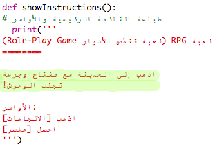

## الفوز في اللعبة

لنحدِّد مهمة للاعب بحيث يجب أن يُكملها حتى يفوز باللعبة.

+ في هذه اللعبة، يفوز اللاعب عندما يهرب من المنزل ويصل إلى الحديقة. كما يجب أن يكون معه المفتاح والمشروب السحري. موضح أدناه خريطة اللعبة.

  

+ أولًا، ستحتاج إلى إضافة حديقة جنوب غرفة الطعام. تذكَّر أن تضيف أبوابًا للربط بالغرف الأخرى في المنزل.
  
  

+ أضف مشروبًا سحريًا داخل غرفة الطعام (أو غرفة أخرى في المنزل).

  
  
+ أضف هذه التعليمات البرمجية لتسمح للاعب بالفوز باللعبة عندما يصل إلى الحديقة ومعه المفتاح والمشروب السحري:

  

  تأكد من إضافة مسافة بادئة قبل هذه التعليمات البرمجية بحيث تكون ضمن التعليمة البرمجية أعلاها. تعني هذه التعليمات البرمجية ظهور الرسالة `You escaped the house...YOU WIN!` إذا وصل اللاعب إلى الغرفة 4 (الحديقة) وكان المفتاح والمشروب السحري في المخزون.
  
  إذا كان لديك أكثر من 4 غرف، فقد تحتاج إلى استخدام رقم غرفة مختلف للحديقة في التعليمات البرمجية أعلاه.

+ اختبر لعبتك لتتأكد من أن اللاعب يمكنه الفوز!

  

+ وأخيرًا، لنضف بعض التعليمات إلى اللعبة ليعرف اللاعب ما عليه فعله. قم بتحرير الدالة `()showInstructions` لإضافة المزيد من المعلومات.

  

  ستحتاج إلى إضافة تعليمات لتخبر اللاعب بالأشياء التي يجب أن يجمعها وتلك التي يجب أن يتجنبها!

+ اختبر لعبتك وسترى هذه التعليمات الجديدة.
  
  

