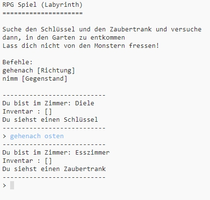

## Einleitung:

In diesem Projekt konzipierst und programmierst du dein eigenes RPG-Labyrinth-Spiel. Das Ziel dieses Spieles ist, Gegenstände einzusammeln und aus einem Haus zu fliehen, ohne dabei von den Monstern gefressen zu werden!

  <iframe src="https://trinket.io/embed/python/d06adeb527?outputOnly=true&start=result" width="600" height="500" frameborder="0" marginwidth="0" marginheight="0" allowfullscreen>
  </iframe>
  

### Zusätzliche Information für Clubleiter

Falls Sie dieses Projekt ausdrucken müssen, verwenden Sie bitte die [druckfreundliche Version](https://projects.raspberrypi.org/en/projects/rpg/print).

## \--- collapse \---

## title: Anmerkungen für Clubleiter

## Einleitung:

Dieses Projekt lehrt, anhand eines RPG-Labyrinth-Spieles, wie man Spiele entwickelt. In diesem Spiel muss der Spieler Gegenstände in einem Haus nehmen und zu einem festgelegten Raum gelangen, ohne den Monstern zu begegnen, die in manchen Räumen lauern. Dieses Spiel behandelt die Anwendung der Datenstrukturen dictionary (Wörterbuch) und list (Liste).

## Online-Ressourcen

**Dieses Projekt verwendet Python 3.** Wir empfehlen die Verwendung von [trinket](https://trinket.io/) um Python-Programme online zu schreiben. Dieses Projekt enthält folgende Trinkets:

+ ['RPG' Start -- jumpto.cc/rpg-go](http://jumpto.cc/rpg-go)

Es gibt auch ein Trinket mit dem fertigen Projekt:

+ [‘RPG’ abgeschlossen -- trinket.io/python/d06adeb527](https://trinket.io/python/d06adeb527)

## Offline-Ressourcen

Falls es erwünscht sein sollte, kann dieses Projekt auch [offline](https://www.codeclubprojects.org/en-GB/resources/python-working-offline/) durchgeführt werden. Sie können auf die Projektressourcen zugreifen, indem Sie auf den Link "Projektmaterial" klicken. Dieser Link enthält einen Abschnitt "Projektressourcen", der Ressourcen enthält, die von den Kindern benötigt werden, um dieses Projekt offline abzuschließen. Stellen Sie sicher, dass jedes Kind Zugriff auf eine Kopie dieser Ressourcen hat. Dieser Abschnitt enthält die folgenden Dateien:

+ rpg/rpg.py

Eine vollständige Version dieses Projekts finden Sie auch im Abschnitt "Ressourcen für Freiwillige". Diese enthält:

+ rpg-finished/rpg.py

(Alle oben genannten Ressourcen können auch als `.zip`-Dateien für Projekte und Freiwillige heruntergeladen werden.)

## Lernziele

+ Spieledesign;
+ Bearbeiten: 
    + Listen (lists);
    + Wörterbücher (dictionaries).
+ Boolesche Ausdrücke.

Dieses Projekt umfasst Elemente aus den folgenden Zweigen des [Raspberry Pi Digital Making Curriculum](http://rpf.io/curriculum):

+ [Verschiedene Programmierkonstrukte kombinieren um ein Problem zu lösen.](https://www.raspberrypi.org/curriculum/programming/builder)

## Herausforderungen

+ Neue Zimmer hinzufügen;
+ Gegenstände zum Einsammeln hinzufügen;
+ Feinde hinzufügen, denen aus dem Weg gegangen werden muss;
+ Dein eigenes Spiel entwickeln.

## Häufig gestellte Fragen

+ Kinder müssen möglicherweise daran erinnert werden, dass Elemente eines Wörterbuchs / einer Liste durch ein Komma getrennt werden. Wenn man zum Beispiel ein neues Zimmer zum 'zimmer'-Wörterbuch hinzufügen will, muss ein Komma zwischen dem neu hinzugefügten Zimmer und dem vorhergehenden Zimmer gesetzt werden.
+ Wenn ein neues Zimmer hinzugefügt wird, vergessen Kinder möglicherweise, eine Verbindung zwischen dem neuen Zimmer und einem bereits existierenden Zimmer hinzuzufügen. Das würde bedeuten, dass ein Spieler den Raum zwar verlassen, aber nicht in ihn hineingehen kann!
+ Der Code zum Prüfen, ob der Spieler gewonnen oder verloren hat, muss eingerückt werden, damit sichergestellt wird, dass er beim Betreten jedes neuen Zimmers ausgeführt wird. Wenn der Code nicht eingerückt wird, befindet er sich außerhalb der Hauptschleife des Spiels und wird nie ausgeführt.

\--- /collapse \---

## \--- collapse \---

## title: Projektmaterialien

## Projektressourcen

+ [.zip-Datei mit allen Projektressourcen](resources/rpg-project-resources.zip)
+ [Online Trinket mit allen Ressourcen des 'RPG'-Projekts](http://jumpto.cc/rpg-go)
+ [rpg/rpg.py](resources/rpg-rpg.py)

## Ressourcen für Clubleiter

+ [.zip-Datei mit allen fertig gestellten Projektressourcen](resources/rpg-volunteer-resources.zip)
+ [Vollständiges Trinket-Projekt (online)](https://trinket.io/python/d06adeb527)
+ [rpg-finished/rpg.py](resources/rpg-finished-rpg.py)

\--- /collapse \---