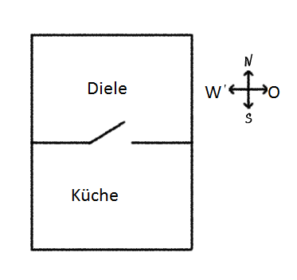
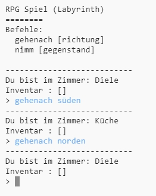
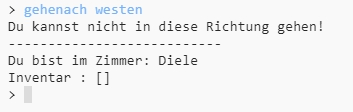
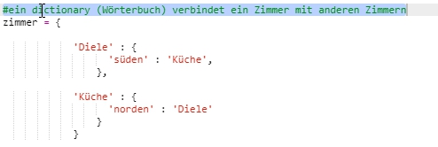
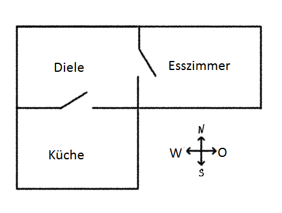
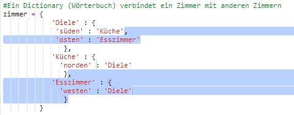
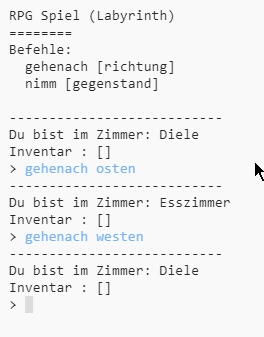

## Neue Zimmer hinzufügen

+ Ein Teil des Codes dieses Spieles steht für dich bereit. Open this trinket: <a href="https://trinket.io/python/cb40c456c0" target="_blank">trinket.io/python/cb40c456c0</a>.

+ Dies ist ein sehr einfaches RPG-Spiel mit nur zwei Zimmern. Hier ist ein Plan des Spiels:
    
    
    
    Du kannst `gehenach süden` eintippen, um von der Diele in die Küche zu gehen, und dann mit `gehenach norden` wieder zurück in die Diele gehen!
    
    

+ Was passiert, wenn du eine Richtung eintippst, in die du nicht gehen kannst? Tippe `gehenach westen` wenn du in der Diele bist, und du erhältst eine freundliche Fehlermeldung.
    
    

+ Wenn du die Variable `zimmer` findest, kannst du sehen, dass der Plan mit einem Wörterbuch (dictionary) von Zimmern programmiert ist:
    
    
    
    Jedes Zimmer ist ein Wörterbuch und die Zimmer sind über Richtungen miteinander verbunden.

+ Fügen wir ein Esszimmer, das sich östlich von der Diele befindet, zum Plan hinzu.
    
    
    
    Du musst ein drittes Zimmer, das `Esszimmer` genannt wird, hinzufügen. Du musst es auch mit der Diele im Westen verbinden. Du musst auch Daten zur Diele hinzufügen, damit du in das Esszimmer im Osten gehen kannst.
    
    

+ Probiere das Spiel mit deinem neuen Esszimmer aus:
    
    
    
    Wenn du nicht in das Esszimmer hinein- oder herausgehen kannst, dann prüfe, ob du den ganzen oben aufgeführten Code eingegeben hast (inklusive der zusätzlichen Kommas im Programm).