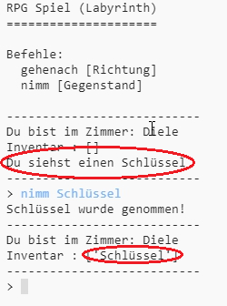

## Gegenstände zum Einsammeln hinzufügen

Lass uns Gegenstände in den Zimmern ablegen, damit der Spieler sie auf seinem Weg durch das Labyrinth einsammeln kann.

\--- task \---

Es ist einfach, einen Gegenstand zum Zimmer hinzuzufügen, du musst ihn nur dem Wörterbuch (dictionary) des Zimmers hinzufügen. Legen wir einen Schlüssel in die Diele.

Denke daran, ein Komma am Ende der Zeile über dem neuen Gegenstand zu setzen, sonst funktioniert dein Programm nicht!

## \--- code \---

language: python

## line_highlights: 6-7

# Ein Dictionary (Wörterbuch) verbindet ein Zimmer mit anderen Zimmern

zimmer = {

            'Diele' : {
                'süden' : 'Küche',
                'osten' : 'Esszimmer',
                'Gegenstand' : 'Schlüssel'
            },
    
            'Küche' : {
                'norden' : 'Diele'
            },
    
            'Esszimmer' : {
                'westen' : 'Diele'
            }
    
        }
    

\--- /code \---

\--- /task \---

\--- task \---

Wenn du den oben angegebenen Code hinzufügst und dann dein Spiel ausführst, siehst du einen Schlüssel in der Diele, und du kannst ihn (mit `nimm Schlüssel`) sogar einsammeln und deinem Inventar hinzufügen!

\--- /task \---