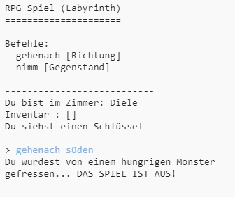

## Feinde (Monster) hinzufügen

Dieses Spiel ist zu einfach! Lass uns Monster in einige Zimmer setzen, denen der Spieler ausweichen muss.

--- task ---

Ein Monster in ein Zimmer zu setzen ist genauso einfach wie einen neuen Gegenstand hineinzulegen. Setzen wir ein hungriges Monster in die Küche:

--- code ---
---
language: python
---

## line_highlights: 11-12

# Ein Dictionary (Wörterbuch) verbindet ein Zimmer mit anderen Zimmern

zimmer = {

            'Diele' : {
                'süden' : 'Küche',
                'osten' : 'Esszimmer',
                'Gegenstand' : 'Schlüssel'
            },
    
            'Küche' : {
                'norden' : 'Diele',
                'Gegenstand' : 'Monster'
            },
    
            'Esszimmer' : {
                'westen' : 'Diele'
            }
    
        }
    

--- /code ---

--- /task ---

--- task ---

Du willst auch, dass das Spiel zu Ende ist, wenn der Spieler ein Zimmer betritt, in dem sich ein Monster aufhält. Du kannst das mit folgendem Code bewerkstelligen, der am Ende des Spiels hinzugefügt wird:

--- code ---
---
language: python
---

## line_highlights: 6-9

        #Andernfalls ist der Gegenstand nicht vorhanden und kann auch nicht genommen werden
        else:
            #Sage dem Spieler, dass er diesen Gegenstand nicht nehmen kann
            print('Du kannst ' + spielzug[1] + ' nicht nehmen!')
    
    #Der Spieler verliert, wenn er ein Zimmer mit einem Monster betritt
    if 'Gegenstand' in zimmer[aktuellesZimmer] and 'Monster' in zimmer[aktuellesZimmer]['Gegenstand']:
        print('Du wurdest von einem hungrigen Monster gefressen... DAS SPIEL IST AUS!')
        break
    

--- /code ---

Dieser Code prüft, ob sich ein Gegenstand im Zimmer befindet; und wenn ja, ob dieser Gegenstand ein Monster ist. Denke daran, dass dieser Code eingerückt ist und er in der gleichen Spalte sein muss wie der Code darüber. Das heißt, jedes Mal wenn der Spieler einen neues Zimmer betritt, prüft das Spiel ob sich dort ein Monster befindet.

--- /task ---

--- task ---

Teste dein Spiel indem du in die Küche gehst, wo sich jetzt ein Monster befindet.

--- /task ---