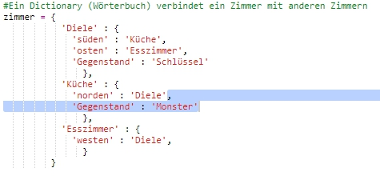

## Feinde (Monster) hinzufügen

Dieses Spiel ist viel zu leicht! Lass uns ein paar Feinde in manche der Zimmer hinzufügen, die der Spieler dann vermeiden muss.

+ Einen Feind in einem Zimmer hinzuzufügen ist genauso einfach wie einen anderen Gegenstand hinzuzufügen. Lass uns ein hungriges Monster in die Küche platzieren:

  

+ Du musst auch darauf achten, dass das Spiel endet, wenn der Spieler ein Zimmer betritt, in dem sich ein Monster befindet. Du kannst dies mit dem folgenden Code schreiben, den du zum Ende des Spiels hinzufügen solltest:

  

  Dieser Code prüft, ob sich in dem Zimmer ein Gegenstand befindet, und wenn ja, ob dieser „Gegenstand“ ein Monster ist. Siehst du hier, dass der Code eingerückt ist? So ist er genau mit dem Code darüber ausgerichtet. Das bedeutet, dass das Spiel jedes Mal, wenn der Spieler ein neues Zimmer betritt, nach einem Monster sucht.

+ Teste deinen Code, indem du in die Küche gehst, in der jetzt ein Monster ist.

  

