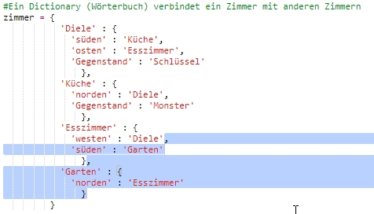
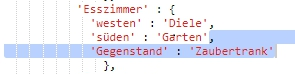
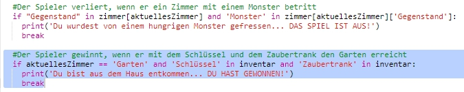
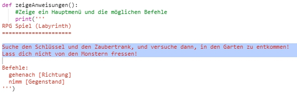

## Das Spiel gewinnen

Lass uns deinem Spieler eine Mission geben, die erfolgreich beendet werden muss, um das Spiel zu gewinnen.

+ In diesem Spiel gewinnt der Spieler, indem er/sie in den Garten gelangt und so das Haus verlässt. Der Spieler muss auch den Schlüssel und den Zaubertrank mitnehmen. Hier ist ein Plan von dem Spiel.

  

+ Als Erstes musst du einen Garten südlich vom Eßzimmer hinzufügen. Denk daran, die Türen hinzuzufügen, damit du den Garten mit den anderen Zimmern im Haus verbinden kannst.
  
  

+ Füge einen Zaubertrank im Eßzimmer (oder in einem beliebigen Zimmer in deinem Haus) hinzu.

  
  
+ Füge diesen Code hinzu, um dem Spieler zu ermöglichen, das Spiel zu gewinnen, wenn er/sie mit dem Schlüssel und dem Zaubertrank in den Garten entkommt:

  

  Achte darauf, dass dieser Code eingerückt ist und genau mit dem darüber gelegenen Code ausgerichtet ist. Dieser Code bedeutet, dass die Meldung `You escaped the house...YOU WIN!` (Du bist aus dem Haus entkommen… DU HAST GEWONNEN!) angezeigt wird, wenn der Spieler sich im 4. Raum (dem Garten befindet) und wenn der Schlüssel und der Zaubertrank im Inventar sind.
  
  Falls du mehr als 4 Zimmer hast, musst du evtl. eine andere Zimmernummer für deinen Garten in dem o.g. Code benutzen.

+ Teste dein Spiel, um zu gewährleisten, dass der Spieler tatsächlich gewinnen kann!

  

+ Und zum Schluss lass uns deinem Spiel noch eine Spielanleitung hinzufügen, damit der Spieler weiß, was er/sie tun muss. Bearbeite die Funktion `showInstructions()` (Anleitung zeigen), um hierin weitere Informationen mit einzubeziehen.

  

  Du wirst die Anleitung mit hinzufügen müssen, um dem Spieler mitzuteilen, welche Gegenstände er/sie einsammeln muss und was er/sie auf jeden Fall vermeiden muss!

+ Teste dein Spiel und du solltest jetzt die neue Spielanleitung sehen können.
  
  
