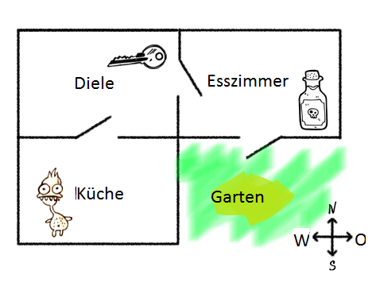
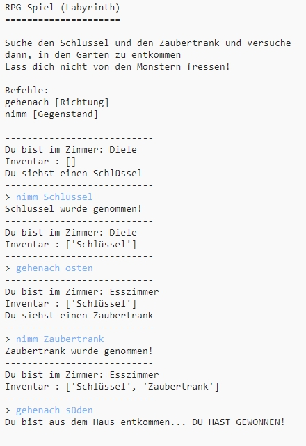
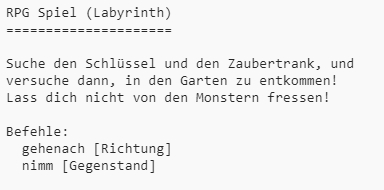

## Das Spiel gewinnen

Geben wir dem Spieler eine Mission die erfüllt werden muss um das Spiel zu gewinnen.

--- task ---

In diesem Spiel gewinnt der Spieler, wenn er aus dem Haus fliehen kann und in den Garten gelangt. Dazu muss er/sie auch den Schlüssel und den Zaubertrank dabei haben. Hier ist eine Karte des Spiels.

--- /task ---

--- task ---

Dazu musst du erst einmal einen Garten im Süden des Esszimmers hinzufügen. Denke daran, Türen hinzuzufügen um ihn mit anderen Zimmern im Haus zu verbinden.

--- code ---
---
language: python
line_highlights: 16-17,18-22
---

# Ein Dictionary (Wörterbuch) verbindet ein Zimmer mit anderen Zimmern

zimmer = {

            'Diele' : {
                'süden' : 'Küche',
                'osten' : 'Esszimmer',
                'Gegenstand' : 'Schlüssel'
            },
    
            'Küche' : {
                'norden' : 'Diele',
                'Gegenstand' : 'Monster'
            },
    
            'Esszimmer' : {
                'westen' : 'Diele',
                'süden' : 'Garten'
            },
    
           'Garten' : {
               'norden' : 'Esszimmer'
        }
    
        }
    

--- /code ---

--- /task ---

--- task ---

Stelle einen Zaubertrank in das Esszimmer (oder in ein anderes Zimmer im Haus).

--- code ---
---
language: python
line_highlights: 3-4
---

            'Esszimmer' : {
                'westen' : 'Diele',
                'süden' : 'Garten',
                'Gegenstand' : 'Zaubertrank'
            },
    

--- /code ---

--- /task ---

--- task ---

Füge diesen Code hinzu damit der Spieler das Spiel gewinnt wenn er den Garten mit dem Schlüssel und dem Zaubertrank erreicht:

--- code ---
---
language: python
line_highlights: 6-9
---

# Der Spieler verliert, wenn er ein Zimmer mit einem Monster betritt

if 'Gegenstand' in zimmer\[aktuellesZimmer] and 'Monster' in zimmer[aktuellesZimmer\]\['Gegenstand'\]: print('Du wurdest von einem hungrigen Monster gefressen... DAS SPIEL IST AUS!') break

# Der Spieler gewinnt, wenn er mit dem Schlüssel und dem Zaubertrank den Garten erreicht

if aktuellesZimmer == 'Garten' and 'Schlüssel' in inventar and 'Zaubertrank' in inventar: print('Du bist aus dem Haus entkommen... DU HAST GEWONNEN!') break

--- /code ---

Vergewissere dich, dass der Code genauso weit wie der darüberstehende Code eingerückt ist. Dieser Code bedeutet, dass die Nachricht `Du bist aus dem Haus entkommen... DU HAST GEWONNEN!` angezeigt wird, wenn der Spieler im 4. Zimmer (dem Garten) ist und sich der Schlüssel und der Zaubertrank in seinem Inventar befinden.

Wenn du mehr als 4 Zimmer hast, musst du vielleicht eine andere Raumnummerierung für den Garten im obenstehenden Code verwenden.

--- /task ---

--- task ---

Prüfe dein Spiel und vergewissere dich, dass der Spieler auch gewinnen kann!

--- /task ---

--- task ---

Lass uns zum Schluss ein paar Anweisungen hinzufügen, damit der Spieler auch weiß, was er tun muss. Bearbeite die Funktion `zeigeAnweisungen()` damit ausführlichere Information angezeigt wird.

--- code ---
---
language: python
line_highlights: 7-8
---

def zeigeAnweisungen(): #Zeige ein Hauptmenü und die möglichen Befehle print('''

# RPG Spiel (Labyrinth)

Suche den Schlüssel und den Zaubertrank und versuche dann, in den Garten zu entkommen. Lass dich nicht von den Monstern fressen!

Befehle: gehenach [Richtung] nimm [Gegenstand] ''')

--- /code ---

Du musst Anleitungen hinzufügen um dem Spieler zu sagen, welche Gegenstände er nehmen muss und wem er ausweichen sollte!

--- /task ---

--- task ---

Prüfe dein Spiel und du solltest die neuen Anweisungen sehen.

--- /task ---