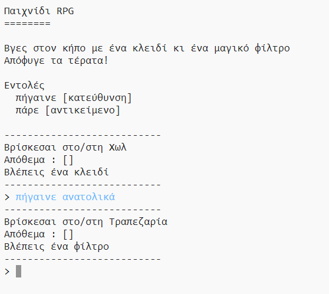

## Εισαγωγή:

Σε αυτό το έργο, θα σχεδιάσεις και θα προγραμματίσεις το δικό σου παιχνίδι λαβύρινθου RPG. Ο στόχος του παιχνιδιού είναι να συλλέξεις αντικείμενα και να ξεφύγεις από ένα σπίτι, φροντίζοντας να αποφύγεις όλα τα τέρατα!

## Τι θα φτιάξεις

--- no-print ---

Γράψε `προχώρα` και μετά μία κατεύθυνση (βόρεια, ανατολικά, νότια ή δυτικά) για να περιπλανηθείς (πχ `προχώρα βόρεια`).

Γράψε `πάρε` για να πάρεις ένα αντικείμενο που βλέπεις (πχ `πάρε κλειδί`).

  <iframe src="https://trinket.io/embed/python/3c3427c257?outputOnly=true&start=result" width="600" height="500" frameborder="0" marginwidth="0" marginheight="0" allowfullscreen>
  </iframe>
  

--- /no-print ---

--- print-only ---

--- /print-only ---

--- collapse ---
---
title: Τι θα χρειαστείς
---
### Υλικό

+ Ένας υπολογιστής ικανός να τρέχει το Scratch 3

### Λογισμικό

+ Python 3 (είτε [online](https://trinket.io/){:target="_blank"} είτε [offline](https://www.python.org/downloads/){:target="_blank"})

### Λήψεις

Το αρχικό project μπορεί να βρεθεί [εδώ](http://rpf.io/p/el-GR/rpg-go){:target="_blank"}.

--- /collapse ---

--- collapse ---
---
title: Τι θα μάθεις
---
+ Σχεδιασμός παιχνιδιών.
+ Επεξεργασία: 
    + Λίστες
    + Λεξικά.
+ Εκφράσεις τύπου Boolean.

Αυτό το έργο καλύπτει στοιχεία από τις ακόλουθες πτυχές του [Raspberry Pi Digital Curriculum Making](http://rpf.io/curriculum):

+ [Συνδύασε δομές προγραμματισμού για να λύσεις ένα πρόβλημα.](https://www.raspberrypi.org/curriculum/programming/builder)

--- /collapse ---

--- collapse ---
---
title: Πρόσθετες πληροφορίες για εκπαιδευτικούς
---
Αν χρειαστεί να εκτυπώσεις αυτό το έργο, χρησιμοποίησε την [εκτυπώσιμη έκδοση](https://projects.raspberrypi.org/el-GR/projects/rpg/print).

Μπορείς να βρεις [το ολοκληρωμένο έργο εδώ](http://rpf.io/p/el-GR/rpg-get){:target="_blank"}.

--- /collapse ---