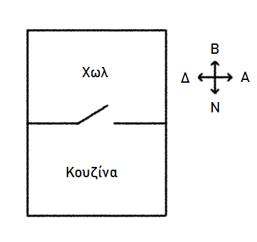
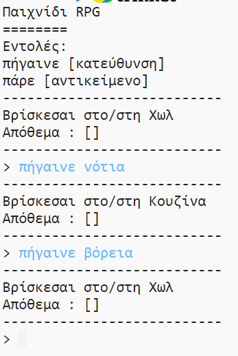
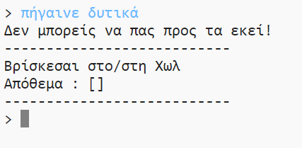
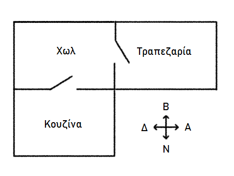
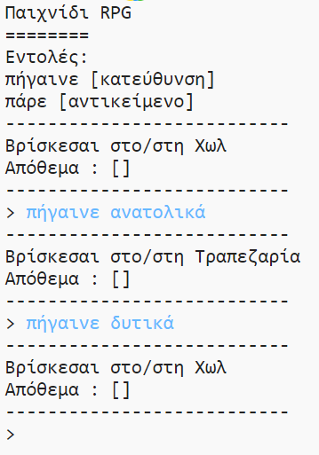

## Προσθήκη νέων δωματίων

\--- task \--- Open the Python starter project.

**Online**: open the starter project at [rpf.io/rpgon](http://rpf.io/rpgon){:target="_blank"}.

**Offline**: open the [starter project](http://rpf.io/p/en/rpg-go){:target="_blank"} in the offline editor. \--- /task \---

\--- task \--- This is a very basic RPG game that only has 2 rooms. Εδώ είναι ένας χάρτης του παιχνιδιού:

Μπορείς να πληκτρολογήσεις `πήγαινε νότια` για να μετακινηθείς από το χωλ στην κουζίνα, και στη συνέχεια `πήγαινε βόρεια` για να επιστρέψεις ξανά στο χωλ!

 \--- /task \---

\--- task \--- What happens when you type in a direction that you cannot go? Πληκτρολόγησε `πήγαινε δυτικά` ενώ είσαι στο χωλ και θα εμφανιστεί ένα μήνυμα λάθους.

 \--- /task \---

\--- task \--- If you find the `rooms` variable, you can see that the map is coded as a dictionary of rooms:

## \--- code \---

## language: python

# ένα λεξικό που συνδέει ένα δωμάτιο με τα άλλα

rooms = {

            'Hall' : {
                'south' : 'Kitchen'
            },
    
            'Kitchen' : {
                'north' : 'Hall'
            }
    
        }
    

\--- /code \---

Each room is a dictionary, and rooms are linked together using directions.  
\--- /task \---

\--- task \--- Let’s add a dining room to your map, to the east of the hall.

You need to add a 3rd room, called the `dining room`, and link it to the hall (to the west). Πρέπει επίσης να προσθέσεις δεδομένα στο χωλ, ώστε να μπορείς να μετακινηθείς ανατολικά προς την τραπεζαρία.

**Don't forget that you'll also need to add commas to lines before your new code.**

## \--- code \---

language: python

## line_highlights: 5-6,11-15

# ένα λεξικό που συνδέει ένα δωμάτιο με τα άλλα

rooms = {

            'Hall' : {
                'south' : 'Kitchen',
                'east' : 'Dining Room'
            },
    
            'Kitchen' : {
                'north' : 'Hall'
            },
    
            'Dining Room' : {
                'west' : 'Hall'
            }
    
        }
    

\--- /code \--- \--- /task \---

\--- task \--- Try out the game with your new dining room:

Εάν δεν μπορείς να μετακινηθείς προς και από την τραπεζαρία, έλεγξε ότι έχεις προσθέσει όλο τον παραπάνω κώδικα (μαζί με τα επιπλέον κόμματα στις παραπάνω γραμμές). \--- /task \---