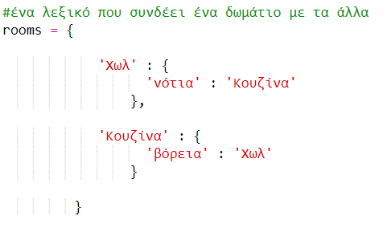
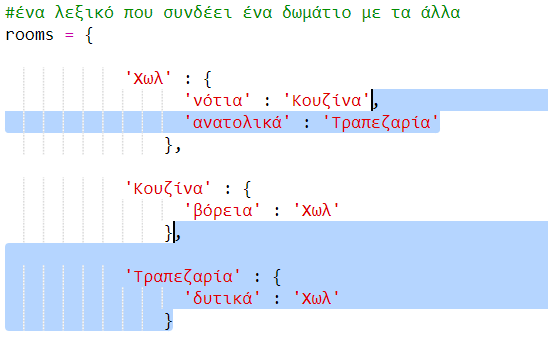

## Προσθήκη νέων δωματίων

+ Ένα μέρος του κώδικα για αυτό το παιχνίδι είναι ήδη έτοιμο για να το χρησιμοποιήσεις. Άνοιξε αυτό το trinket: <a href="http://jumpto.cc/rpg-go" target="_blank">jumpto.cc/rpg-go</a>.

+ Αυτό είναι ένα πολύ βασικό παιχνίδι ρόλων (RPG) που έχει μόνο 2 δωμάτια. Εδώ είναι ένας χάρτης του παιχνιδιού:
    
    
    
    Μπορείς να πληκτρολογήσεις `πήγαινε νότια` για να μετακινηθείς από το χωλ στην κουζίνα, και στη συνέχεια `πήγαινε βόρεια` για να επιστρέψεις ξανά στο χωλ!
    
    

+ Τι συμβαίνει όταν πληκτρολογείς προς μια κατεύθυνση που δεν μπορείς να πας; Πληκτρολόγησε `πήγαινε δυτικά` ενώ είσαι στο χωλ και θα εμφανιστεί ένα μήνυμα λάθους.
    
    

+ Αν κοιτάξεις στη μεταβλητή `rooms` (δωμάτια), θα δεις ότι ο χάρτης έχει μοντελοποιηθεί ως λεξικό δωματίων:
    
    
    
    Κάθε δωμάτιο είναι ένα λεξικό και τα δωμάτια συνδέονται μεταξύ τους με κατευθύνσεις.

+ Ας προσθέσουμε μια τραπεζαρία στο χάρτη σου, στα ανατολικά του χωλ.
    
    
    
    Θα προσθέσεις ένα τρίτο δωμάτιο, που ονομάζεται `τραπεζαρία`. Πρέπει επίσης να το συνδέσεις με το χωλ προς τα δυτικά. Πρέπει επίσης να προσθέσεις δεδομένα στο χωλ, ώστε να μπορείς να μετακινηθείς ανατολικά προς την τραπεζαρία.
    
    

+ Δοκίμασε το παιχνίδι με τη νέα σου τραπεζαρία:
    
    
    
    Εάν δεν μπορείς να μετακινηθείς προς και από την τραπεζαρία, έλεγξε ότι έχεις προσθέσει όλο τον παραπάνω κώδικα (μαζί με τα επιπλέον κόμματα στις παραπάνω γραμμές).