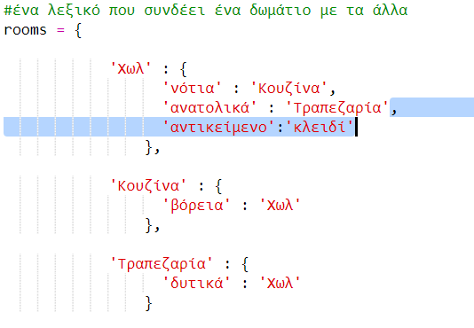
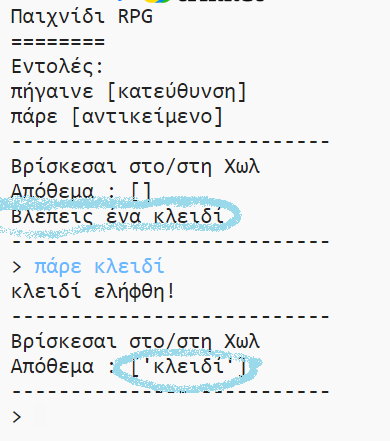

## Προσθήκη αντικειμένων για συλλογή

Ας αφήσουμε μερικά αντικείμενα στα δωμάτια για να τα μαζέψει ο παίκτης καθώς κινείται μέσα στον λαβύρινθο.

+ Η προσθήκη ενός αντικείμενου σε ένα δωμάτιο είναι εύκολη, μπορείς απλά να το προσθέσεις στο λεξικό ενός δωματίου. Ας βάλουμε ένα κλειδί στο χωλ.
    
    
    
    Θυμήσου να βάλεις ένα κόμμα μετά τη γραμμή πάνω από το νέο αντικείμενο αλλιώς το πρόγραμμά σου δεν θα τρέξει!

+ Αν εκτελέσεις το παιχνίδι σου μετά την προσθήκη του παραπάνω κώδικα, μπορείς πλέον να δεις ένα κλειδί στην αίθουσα και μπορείς ακόμη και να το πάρεις (πληκτρολογώντας `πάρε κλειδί`) για να το προσθέσεις στο απόθεμά σου!
    
    