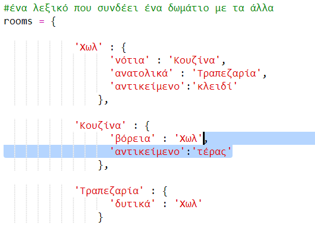
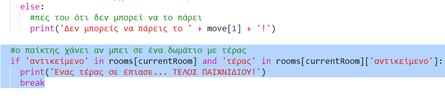

## Προσθήκη εχθρών

Αυτό το παιχνίδι παρά είναι εύκολο! Ας προσθέσουμε εχθρούς σε κάποια δωμάτια που ο παίκτης πρέπει να αποφύγει.

+ Η προσθήκη ενός εχθρού σε ένα δωμάτιο είναι τόσο απλή όσο η προσθήκη οποιουδήποτε άλλου αντικειμένου. Ας προσθέσουμε ένα πεινασμένο τέρας στην κουζίνα:
    
    

+ Επίσης, θα πρέπει να βεβαιωθείς ότι το παιχνίδι τελειώνει εάν ο παίκτης εισέλθει σε ένα δωμάτιο με ένα τέρας. Μπορείς να το κάνεις με τον παρακάτω κώδικα, τον οποίο πρέπει να προσθέσεις στο τέλος του παιχνιδιού:
    
    
    
    Αυτός ο κώδικας ελέγχει εάν υπάρχει ένα αντικείμενο στο δωμάτιο και αν ναι, αν το αντικείμενο είναι ένα τέρας. Παρατήρησε ότι ο κώδικας αυτός είναι σε εσοχή, ευθυγραμμισμένος με τον κώδικα από πάνω του. Αυτό σημαίνει ότι το παιχνίδι θα ελέγξει αν υπάρχει τέρας κάθε φορά που ο παίκτης μετακινείται σε ένα νέο δωμάτιο.

+ Δοκίμασε τον κώδικά σου πηγαίνοντας στην κουζίνα, η οποία τώρα περιέχει ένα τέρας.
    
    