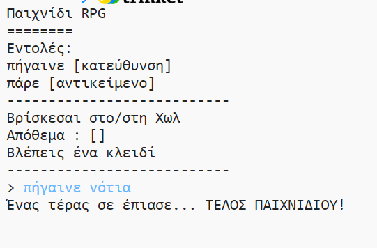

## Προσθήκη εχθρών

Αυτό το παιχνίδι παρά είναι εύκολο! Ας προσθέσουμε εχθρούς σε κάποια δωμάτια που ο παίκτης πρέπει να αποφύγει.

--- task ---

Η προσθήκη ενός εχθρού σε ένα δωμάτιο είναι τόσο απλή όσο η προσθήκη οποιουδήποτε άλλου αντικειμένου. Ας προσθέσουμε ένα πεινασμένο τέρας στην κουζίνα:

--- code ---
---
language: python
line_highlights: 11-12
---
# ένα λεξικό που συνδέει ένα δωμάτιο με τα άλλα
room = {

            'Χωλ' : {
                'νότια' : 'Κουζίνα',
                'ανατολικά' : 'Τραπεζαρία',
                'αντικείμενο' : 'κλειδί'
            },
    
            'Κουζίνα' : {
                'βόρεια' : 'Χωλ',
                'αντικείμενο' : 'τέρας'
            },
    
            'Τραπεζαρία' : {
                'δυτικά' : 'Χωλ'
            }
    
        }
--- /code ---

--- /task ---

--- task ---

Επίσης, θα πρέπει να βεβαιωθείς ότι το παιχνίδι τελειώνει εάν ο παίκτης εισέλθει σε ένα δωμάτιο με ένα τέρας. Μπορείς να το κάνεις με τον παρακάτω κώδικα, τον οποίο πρέπει να προσθέσεις στο τέλος του παιχνιδιού:

--- code ---
---
language: python
line_highlights: 6-9
---
        #αλλιώς, αν το αντικείμενο δεν υπάρχει εκεί
        else:
            #πες ότι δεν μπορεί να το πάρει
            print('Δεν μπορώ να πάρω το' + move[1] + '!')
    
    #ο παίκτης χάνει, αν μπει σε δωμάτιο με τέρας 
    if 'αντικείμενο' in rooms[currentRoom] and 'τέρας' in rooms[currentRoom]['αντικείμενο']:
        print('Ένα τέρας σε έπιασε... ΤΕΛΟΣ ΠΑΙΧΝΙΔΙΟΥ!')
        break
--- /code ---

Αυτός ο κώδικας ελέγχει εάν υπάρχει ένα αντικείμενο στο δωμάτιο και αν ναι, αν το αντικείμενο είναι ένα τέρας. Παρατήρησε ότι ο κώδικας αυτός είναι σε εσοχή, ευθυγραμμισμένος με τον κώδικα από πάνω του. Αυτό σημαίνει ότι το παιχνίδι θα ελέγξει αν υπάρχει τέρας κάθε φορά που ο παίκτης μετακινείται σε ένα νέο δωμάτιο.

--- /task ---

--- task ---

Δοκίμασε τον κώδικά σου πηγαίνοντας στην κουζίνα, η οποία τώρα περιέχει ένα τέρας.

--- /task ---