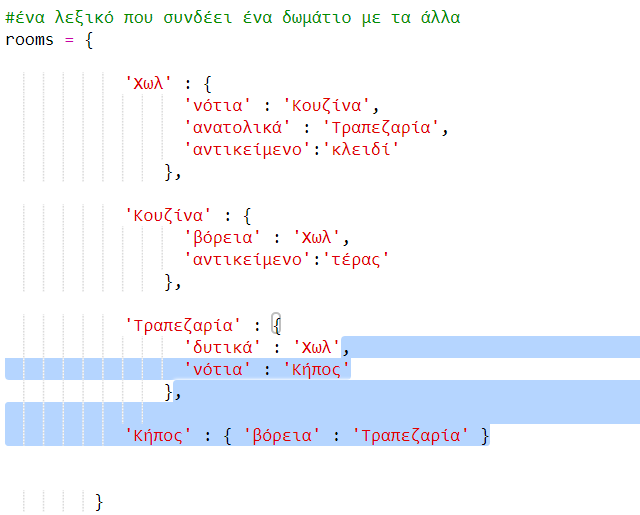
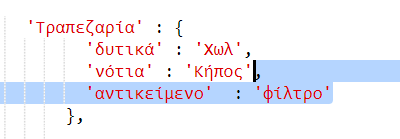
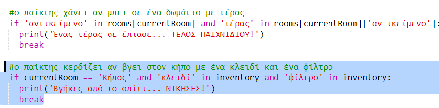
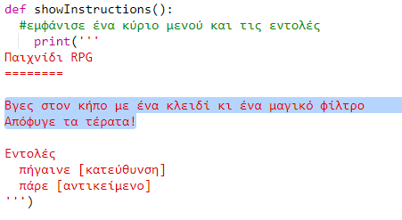

## Κερδίζοντας το παιχνίδι

Ας δώσουμε στον παίκτη σου μια αποστολή, η οποία πρέπει να ολοκληρωθεί για να κερδίσει το παιχνίδι.

+ Σε αυτό το παιχνίδι, ο παίκτης κερδίζει φτάνοντας στον κήπο και βγαίνοντας από το σπίτι. Πρέπει επίσης να έχει το κλειδί μαζί του και το μαγικό φίλτρο. Εδώ είναι ένας χάρτης του παιχνιδιού.
    
    

+ Πρώτα, θα πρέπει να προσθέσεις έναν κήπο στα νότια της τραπεζαρίας. Θυμήσου να προσθέσεις πόρτες, για να συνδεθεί με άλλα δωμάτια του σπιτιού.
    
    

+ Πρόσθεσε ένα φίλτρο στην τραπεζαρία (ή σε άλλο δωμάτιο στο σπίτι σου).
    
    

+ Πρόσθεσε αυτόν τον κώδικα για να επιτρέψεις στον παίκτη να κερδίσει το παιχνίδι όταν φτάσει στον κήπο με το κλειδί και το φίλτρο:
    
    
    
    Βεβαιώσου ότι ο κώδικας αυτός είναι σε εσοχή, σύμφωνα με τον παραπάνω κώδικα. Αυτός ο κώδικας σημαίνει ότι το μήνυμα `Βγήκες από το σπίτι ... ΚΕΡΔΙΣΕΣ!` εμφανίζεται αν ο παίκτης βρίσκεται στο δωμάτιο 4 (στον κήπο) και αν το κλειδί και το φίλτρο βρίσκονται στο απόθεμα.
    
    Αν έχεις περισσότερα από 4 δωμάτια, ίσως χρειαστεί να χρησιμοποιήσεις διαφορετικό αριθμό δωματίων για τον κήπο σου στον παραπάνω κώδικα.

+ Δοκίμασε το παιχνίδι σου για να βεβαιωθείς ότι ο παίκτης μπορεί να κερδίσει!
    
    

+ Τέλος, ας προσθέσουμε κάποιες οδηγίες στο παιχνίδι σου, έτσι ώστε ο παίκτης να ξέρει τι πρέπει να κάνει. Επεξεργάσου τη συνάρτηση `showInstructions()` για να συμπεριλάβεις περισσότερες πληροφορίες.
    
    
    
    Θα χρειαστεί να προσθέσεις οδηγίες για να πεις στο χρήστη ποια αντικείμενα πρέπει να συλλέξει και τι χρειάζεται να αποφύγει!

+ Δοκίμασε το παιχνίδι σου και έλεγξε αν εμφανίζονται οι νέες οδηγίες σου.
    
    