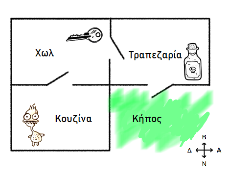
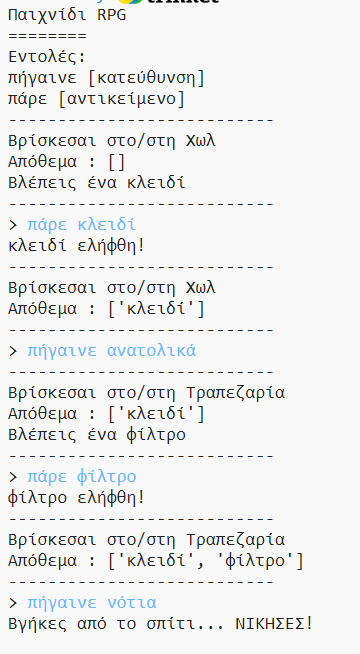

## Κερδίζοντας το παιχνίδι

Ας δώσουμε στον παίκτη σου μια αποστολή, η οποία πρέπει να ολοκληρωθεί για να κερδίσει το παιχνίδι.

\--- task \---

Σε αυτό το παιχνίδι, ο παίκτης κερδίζει φτάνοντας στον κήπο και βγαίνοντας από το σπίτι. Πρέπει επίσης να έχει το κλειδί μαζί του και το μαγικό φίλτρο. Εδώ είναι ένας χάρτης του παιχνιδιού.

\--- /task \---

\--- task \---

Πρώτα, θα πρέπει να προσθέσεις έναν κήπο στα νότια της τραπεζαρίας. Θυμήσου να προσθέσεις πόρτες, για να συνδεθεί με άλλα δωμάτια του σπιτιού.

## \--- code \---

language: python

## line_highlights: 16-17,18-22

# ένα λεξικό που συνδέει ένα δωμάτιο με τα άλλα

rooms = {

            'Χωλ' : {
                'νότια' : 'Κουζίνα',
                'ανατολικά' : 'Τραπεζαρία',
                'αντικείμενο' : 'κλειδί'
            },
    
            'Κουζίνα' : {
                'βόρεια' : 'Χωλ',
                'αντικείμενο' : 'τέρας'
            },
    
            'Τραπεζαρία' : {
                'δυτικά' : 'Χωλ',
                'νότια' : 'Κήπος'
            },
    
            'Κήπος' : {
                'βόρεια' : 'Τραπεζαρία'
            }
    
        }
    

\--- /code \---

\--- /task \---

\--- task \---

Πρόσθεσε ένα φίλτρο στην τραπεζαρία (ή σε άλλο δωμάτιο στο σπίτι σου).

## \--- code \---

language: python

## line_highlights: 3-4

            'Τραπεζαρία' : {
                'δυτικά' : 'Χωλ',
                'νότια' : 'Κήπος',
                'αντικείμενο' : 'φίλτρο'
            },
    

\--- /code \---

\--- /task \---

\--- task \---

Πρόσθεσε αυτόν τον κώδικα για να επιτρέψεις στον παίκτη να κερδίσει το παιχνίδι όταν φτάσει στον κήπο με το κλειδί και το φίλτρο:

## \--- code \---

language: python

## line_highlights: 6-9

# ο παίκτης χάνει, αν μπει σε ένα δωμάτιο με τέρας

if 'αντικείμενο' in rooms\[currentRoom] and 'τέρας' in rooms[currentRoom\]\['αντικείμενο'\]: print('Ένα τέρας σε έπιασε... ΤΕΛΟΣ ΠΑΙΧΝΙΔΙΟΥ!') break

# ο παίκτης κερδίζει, αν βγει στον κήπο με ένα κλειδί και ένα φίλτρο

if currentRoom == 'Κήπος' and 'κλειδί' in inventory and 'φίλτρο' in inventory: print('Βγήκες από το σπίτι... ΚΕΡΔΙΣΕΣ!') break

\--- /code \---

Βεβαιώσου ότι ο κώδικας αυτός είναι σε εσοχή, σύμφωνα με τον παραπάνω κώδικα. Αυτός ο κώδικας σημαίνει ότι το μήνυμα `Βγήκες από το σπίτι ... ΚΕΡΔΙΣΕΣ!` εμφανίζεται αν ο παίκτης βρίσκεται στο δωμάτιο 4 (στον κήπο) και αν το κλειδί και το φίλτρο βρίσκονται στο απόθεμα.

Αν έχεις περισσότερα από 4 δωμάτια, ίσως χρειαστεί να χρησιμοποιήσεις διαφορετικό αριθμό δωματίων για τον κήπο σου στον παραπάνω κώδικα.

\--- /task \---

\--- task \---

Δοκίμασε το παιχνίδι σου για να βεβαιωθείς ότι ο παίκτης μπορεί να κερδίσει!

\--- /task \---

\--- task \---

Τέλος, ας προσθέσουμε κάποιες οδηγίες στο παιχνίδι σου, έτσι ώστε ο παίκτης να ξέρει τι πρέπει να κάνει. Επεξεργάσου τη συνάρτηση `showInstructions()` για να συμπεριλάβεις περισσότερες πληροφορίες.

## \--- code \---

language: python

## line_highlights: 7-8

def showInstructions(): #εμφάνισε ένα κεντρικό μενού και τις εντολές print('''

# Παιχνίδι RPG

Βγες στον Κήπο με ένα κλειδί κι ένα φίλτρο Απέφυγε τα τέρατα!

Εντολές: πήγαινε [κατεύθυνση] πάρε [αντικείμενο] ''') \--- /code \---

\--- /code \---

Θα χρειαστεί να προσθέσεις οδηγίες για να πεις στο χρήστη ποια αντικείμενα πρέπει να συλλέξει και τι χρειάζεται να αποφύγει!

\--- /task \---

\--- task \---

Δοκίμασε το παιχνίδι σου και έλεγξε αν εμφανίζονται οι νέες οδηγίες σου.

\--- /task \---