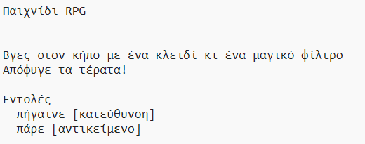

## Κερδίζοντας το παιχνίδι

Ας δώσουμε στον παίκτη σου μια αποστολή, η οποία πρέπει να ολοκληρωθεί για να κερδίσει το παιχνίδι.

\--- task \--- In this game, the player wins by getting to the garden and escaping the house. Πρέπει επίσης να έχει το κλειδί μαζί του και το μαγικό φίλτρο. Εδώ είναι ένας χάρτης του παιχνιδιού.

 \--- /task \---

\--- task \--- First, you need to add a garden to the south of the dining room. Θυμήσου να προσθέσεις πόρτες, για να συνδεθεί με άλλα δωμάτια του σπιτιού.

## \--- code \---

language: python

## line_highlights: 16-17,18-22

# ένα λεξικό που συνδέει ένα δωμάτιο με τα άλλα

rooms = {

            'Hall' : {
                'south' : 'Kitchen',
                'east' : 'Dining Room',
                'item' : 'key'
            },
    
            'Kitchen' : {
                'north' : 'Hall',
                'item' : 'monster'
            },
    
            'Dining Room' : {
                'west' : 'Hall',
                'south' : 'Garden'
            },
    
            'Garden' : {
                'north' : 'Dining Room'
            }
    
        }
    

\--- /code \--- \--- /task \---

\--- task \--- Add a potion to the dining room (or another room in your house).

## \--- code \---

language: python

## line_highlights: 3-4

            'Dining Room' : {
                'west' : 'Hall',
                'south' : 'Garden',
                'item' : 'potion'
            },
    

\--- /code \--- \--- /task \---

\--- task \--- Add this code to allow the player to win the game when they get to the garden with the key and the potion:

## \--- code \---

language: python

## line_highlights: 6-9

# player loses if they enter a room with a monster

if 'item' in rooms\[currentRoom] and 'monster' in rooms[currentRoom\]\['item'\]: print('A monster has got you... GAME OVER!') break

# player wins is they get to the garden with the key and potion

if currentRoom == 'Garden' and 'key' in inventory and 'potion' in inventory: print('You escaped the house... YOU WIN!') break \--- /code \---

Βεβαιώσου ότι ο κώδικας αυτός είναι σε εσοχή, σύμφωνα με τον παραπάνω κώδικα. Αυτός ο κώδικας σημαίνει ότι το μήνυμα `Βγήκες από το σπίτι ... ΚΕΡΔΙΣΕΣ!` εμφανίζεται αν ο παίκτης βρίσκεται στο δωμάτιο 4 (στον κήπο) και αν το κλειδί και το φίλτρο βρίσκονται στο απόθεμα.

Αν έχεις περισσότερα από 4 δωμάτια, ίσως χρειαστεί να χρησιμοποιήσεις διαφορετικό αριθμό δωματίων για τον κήπο σου στον παραπάνω κώδικα. \--- /task \---

\--- task \--- Test your game to make sure the player can win!

 \--- /task \---

\--- task \--- Finally, let’s add some instructions to your game, so that the player knows what they have to do. Επεξεργάσου τη συνάρτηση `showInstructions()` για να συμπεριλάβεις περισσότερες πληροφορίες.

## \--- code \---

language: python

## line_highlights: 7-8

def showInstructions(): #print a main menu and the commands print('''

# Παιχνίδι RPG

Get to the Garden with a key and a potion Avoid the monsters!

Commands: go [direction] get [item] ''') \--- /code \---

Θα χρειαστεί να προσθέσεις οδηγίες για να πεις στο χρήστη ποια αντικείμενα πρέπει να συλλέξει και τι χρειάζεται να αποφύγει! \--- /task \---

\--- task \--- Test your game and you should see your new instructions.

 \--- /task \---