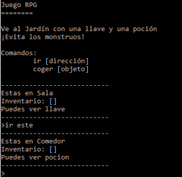

## Introducción:

En este proyecto vas a diseñar y programar tu propio juego de laberinto RPG. El objetivo del juego será recoger objetos y escapar de una casa, ¡asegurándote de evitar todos los monstruos!

## Lo que harás

\--- no-print \---

Escribe `ir` y después una dirección (norte, este, sur, oeste) para moverte en el mundo (por ejemplo `ir norte`).

Escribe `coger` para coger los objetos que puedes ver (por ejemplo `coger llave`).

  <iframe src="https://trinket.io/embed/python/d06adeb527?outputOnly=true&start=result" width="600" height="500" frameborder="0" marginwidth="0" marginheight="0" allowfullscreen>
  </iframe>
  

\--- /no-print \---

\--- print-only \---

\--- /print-only \---

\--- collapse \---

* * *

## title: Lo que necesitarás

### Hardware

+ Un ordenador capaz de ejecutar Python

### Software

+ Python 3 (tanto [online](https://trinket.io/){:target="_blank"} como [offline](https://www.python.org/downloads/){:target="_blank"}){:target="_blank"}{:target="_blank"}

### Descargas

El proyecto de iniciación puede encontrarse [aquí](http://rpf.io/p/en/rpg-go){:target="_blank"}.

\--- /collapse \---

\--- collapse \---

* * *

## title: Lo que vas a aprender

+ Diseño de Juegos;
+ Edición: 
    + Listas;
    + Diccionarios.
+ Expresiones booleanas.

Este proyecto incluye elementos desde los siguientes aspectos del [curríulo de digitalización de Raspberry Pi](http://rpf.io/curriculum):

+ [Combina construcciones de programación para resolver un problema.](https://www.raspberrypi.org/curriculum/programming/builder)

\--- /collapse \---

\--- collapse \---

* * *

## title: Información adicional para educadores

Si necesitas imprimir este proyecto, usa la [versión para imprimir](https://projects.raspberrypi.org/en/projects/rpg/print).

Puedes [encontrar la solución para este proyecto aquí](http://rpf.io/p/en/rpg-get){:target="_blank"}.

\--- /collapse \---