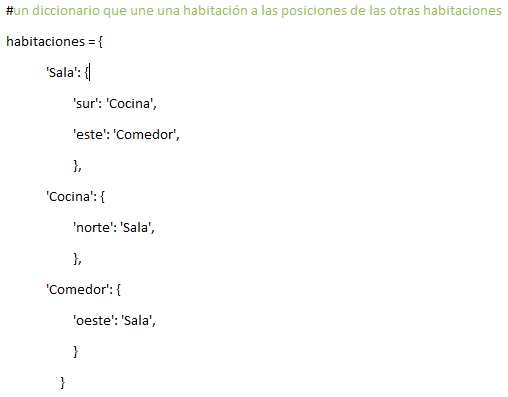

## Añadir nuevas habitaciones

+ Parte del código ya ha sido escrita para ti. Abre este Trinket: <a href="http://jumpto.cc/rpg-go" target="_blank">jumpto.cc/rpg-go</a>.

+ Este es un juego RPG muy básico que sólo tiene 2 habitaciones. Aquí hay un mapa del juego:
    
    
    
    ¡Puedes escribir `ir sur` para moverte de la sala a la cocina, y luego `ir norte` para regresar a la sala!
    
    

+ ¿Qué pasa cuando escribes una dirección en la cual no puedes ir? Escribe `ir oeste` en la sala y obtendrás un mensaje de error.
    
    

+ Si te fijas en la variable `rooms`, verás que el mapa está codificado como un diccionario de habitaciones:
    
    
    
    Cada habitación es un diccionario y las habitaciones están ligadas entre ellas usando direcciones.

+ Agreguemos un comedor a tu mapa, al este de la sala.
    
    
    
    Necesitas agregar una tercera habitación, llamada el `comedor`. También necesitas unirlo con la sala al oeste. También necesitas agregar datos a la sala, así puedes moverte hacia el comedor al este.
    
    

+ Prueba el juego con tu nuevo comedor:
    
    
    
    Si no puedes entrar y salir del comedor, verifica que agregaste todo el código de arriba (incluyendo las comas extra).