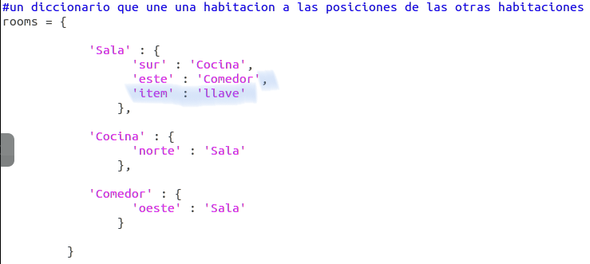

## Adición de elementos a recaudar

Dejemos elementos en las habitaciones para que el jugador los recoja según se mueve por el laberinto.

+ Añadir elementos a las habitaciones es sencillo. Simplemente añádelos a un diccionario de la habitación. Coloquemos una llave en el pasillo.

  

  ¡Recuerda poner una coma después de la línea anterior del nuevo elemento o el programa no funcionará!

+ Si ejecutas el juego después de añadir el código anterior, podrás ver una llave en el pasillo e incluso podrás cogerla (escribiendo `get key`), ¡añadiéndola a tu inventario!

    

