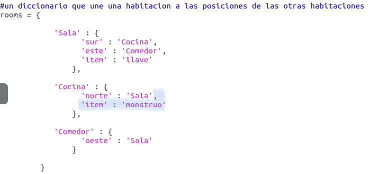
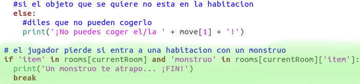
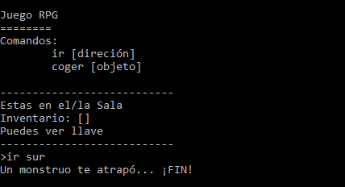

## Añadir enemigos

¡Este juego es demasiado sencillo! Añade enemigos a algunas de las habitaciones para que el jugador los evite.

+ Añadir un enemigo a una habitación es tan sencillo como añadir un elemento. Añadamos un monstruo hambriento a la cocina:

  

+ También debes asegurarte de que el juego finalice si el jugador entra en una habitación que tenga un monstruo en su interior. Podrás lograrlo con el siguiente código que deberás añadir al final del juego:

  

  Este código comprueba si hay un elemento en una habitación y, en dicho caso, si el elemento es un monstruo. Ten en cuenta que este código debe estar sangrado colocándolo en línea con el código anterior. Esto quiere decir que el juego comprobará se hay un monstruo cada vez que el jugador entra en una nueva habitación.

+ Probemos el código entrando en la cocina, en la cual hemos puesto un monstruo.

  
