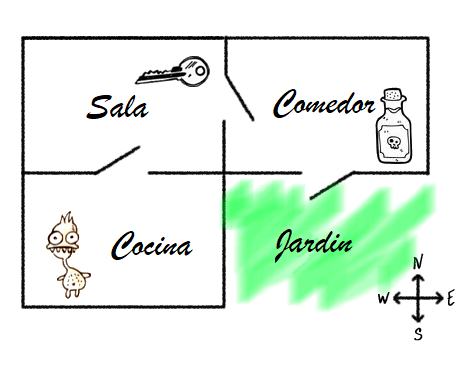
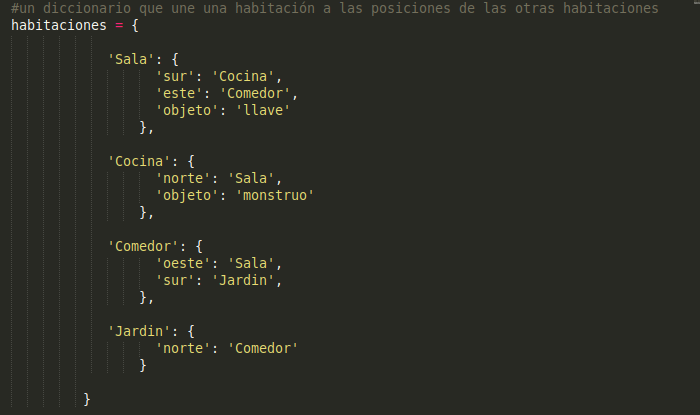
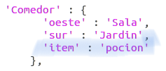
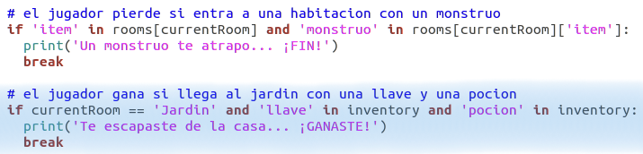
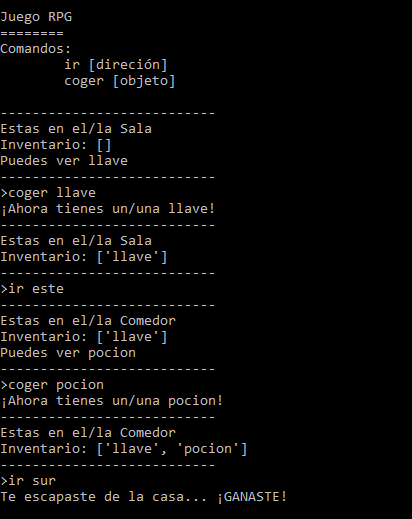
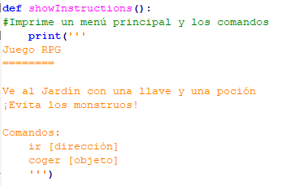
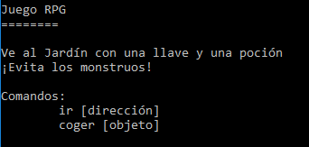

## Ganar el juego

Proporcionemos una misión a tu jugador que deberá completar para acabar el juego.

+ En este juego, el jugador gana llegando al jardín y escapando de la casa. También deberá llevar consigo la llave y la poción mágica. Aquí tienes un mapa del juego.

  

+ En primer lugar, necesitarás añadir un jardín al sur del comedor. Recuerda añadir puertas para enlazar las otras habitaciones en la casa.
  
  

+ Añade una poción al comedor (o a cualquier otra habitación de la casa).

  
  
+ Añade este código para permitir que el jugador gane el juego cuando llegue al jardín con la llave y la poción.

  

  Asegúrate de que este código esté sangrado en línea con el código anterior. Este código hace que el mensaje `You escaped the house...YOU WIN!` sea visualizado si un jugador está en a habitación 4 (jardín) y si la llave y la poción están en su inventario.
  
  Si tienes más de 4 habitaciones, deberás usar un número de habitación distinto para el jardín en el código anterior.

+ ¡Prueba el juego y asegúrate de que el jugador puede ganar!

  

+ Por último, añadamos ciertas instrucciones al juego de modo que el jugador sepa qué tiene que hacer. Edita la función `showInstructions()` para incluir más información.

  

  ¡Necesitarás añadir instrucciones para indicar al usuario qué elementos necesita recaudar y qué debe evitar!

+ Prueba tu juego. Deberías ser capaz de ver las nuevas instrucciones.
  
  
