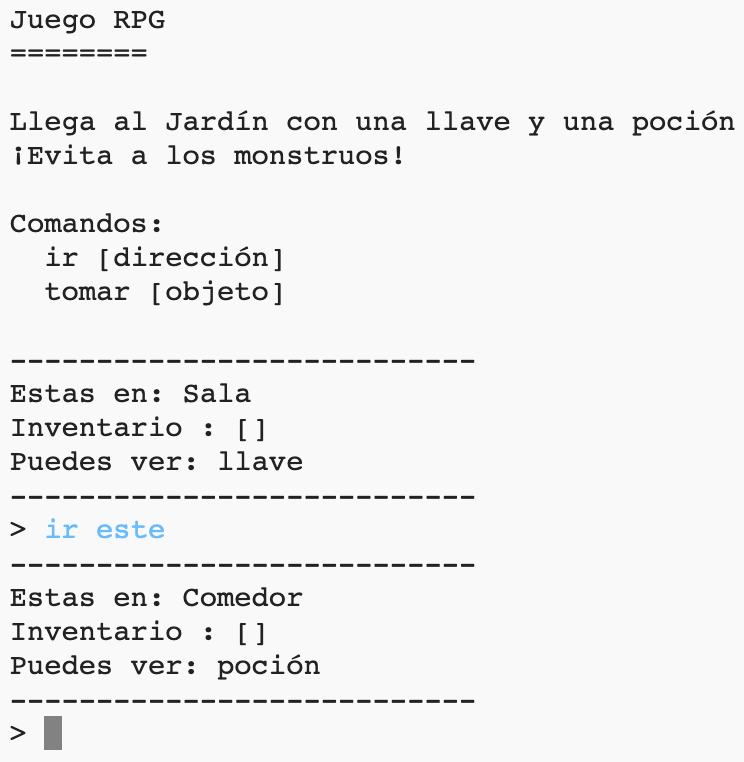

## Introducción

En este proyecto, vas a diseñar y programar tu propio juego de laberintos RPG. El objetivo del juego será recoger objetos y escapar de una casa, ¡asegurándote de evitar todos los monstruos!

## Lo que harás

--- no-print ---

Escribe `ir` y después una dirección (norte, este, sur, oeste) para moverte en el mundo (por ejemplo `ir al norte`).

Escribe `coger` para coger los objetos que ves (por ejemplo `coger la llave`).

  <iframe src="https://trinket.io/embed/python/d06adeb527?outputOnly=true&start=result" width="600" height="500" frameborder="0" marginwidth="0" marginheight="0" allowfullscreen>
  </iframe>
  

--- /no-print ---

--- print-only ---

--- /print-only ---

--- collapse ---
---
title: Lo que vas a necesitar
---

### Hardware

+ Una computadora que pueda ejecutar Python

### Software

+ Python 3 (ya sea [en línea](https://trinket.io/){:target="_blank"} o [desconectado](https://www.python.org/downloads/){:target="_blank"})

### Descargas

Puedes encontrar el proyecto de inicio [aquí](http://rpf.io/p/es-LA/rpg-go){:target="_blank"}.

--- /collapse ---

--- collapse ---
---
title: Lo que vas a aprender
---

+ Diseño de Juegos;
+ Edición: 
    + Listas;
    + Diccionarios.
+ Expresiones booleanas.

Este proyecto incluye elementos de los siguientes aspectos del [Raspberry Pi Digital Making Curriculum](http://rpf.io/curriculum):

+ [Combina estructuras de programación para resolver un problema.](https://www.raspberrypi.org/curriculum/programming/builder)

--- /collapse ---

--- collapse ---
---
title: Información adicional para educadores
---

Si necesitas imprimir este proyecto, usa la [versión para imprimir](https://projects.raspberrypi.org/es-LA/projects/rpg/print).

Puedes [encontrar la solución para este proyecto aquí](http://rpf.io/p/es-LA/rpg-get){:target="_blank"}.

--- /collapse ---