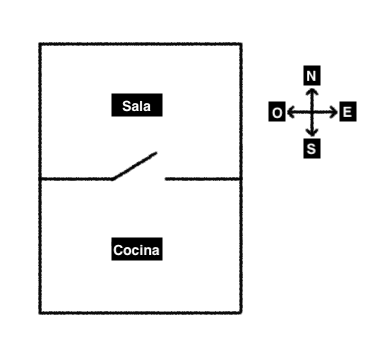
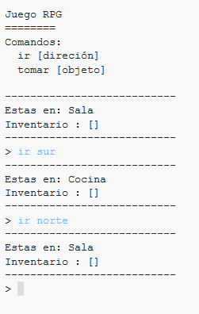
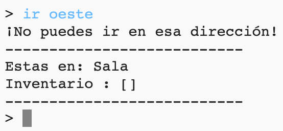
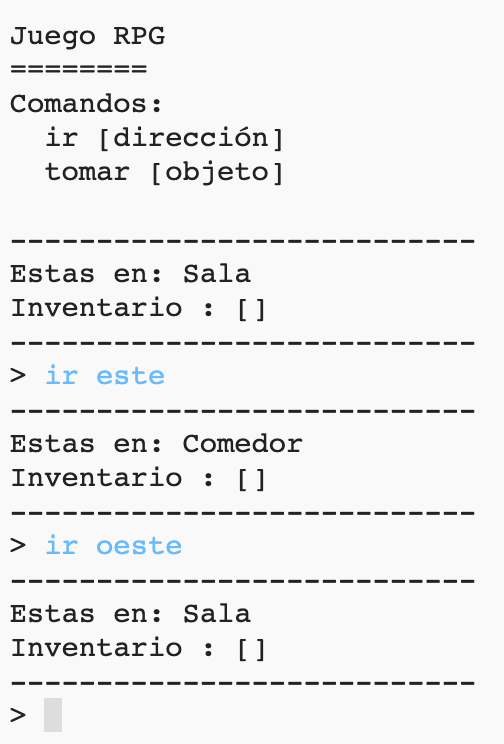

## Añadir nuevas habitaciones

\--- task \---

Abre el proyecto de inicio de Python.

**Online**: abre el proyecto de inicio en [rpf.io/rpgon](http://rpf.io/rpgon){:target="_blank"}.

**Offline**: abre el [proyecto de inicio](http://rpf.io/p/en/rpg-go){:target=_blank"} en el editor offline.

\--- /task \---

\--- task \---

Este es un juego RPG muy básico que sólo tiene 2 habitaciones. Aquí hay un mapa del juego:

Puedes escribir `go south` (ir al sur) para pasar del pasillo a la cocina, y luego `go north` (ir al norte) para volver a la sala de nuevo!

\--- /task \---

\--- task \---

¿Qué pasa cuando escribes una dirección en la que no puedes ir? Escribe `go west` (ir al oeste) en la sala y obtendrás un mensaje de error.

\--- /task \---

\--- task \---

Si te fijas en la variable `habitaciones`, verás que el mapa está codificado como un diccionario de habitaciones:

## \--- code \---

## language: python

# un diccionario que conecta una habitación con las otras habitaciones

habitaciones = {

            'Sala' : {
                'sur' : 'Cocina'
            },
    
            'Cocina' : {
                'norte' : 'Sala'
            }
    
        }
    

\--- /code \---

Cada habitación es un diccionario y las habitaciones están conectadas entre ellas usando direcciones.

\--- /task \---

\--- task \---

Agreguemos un comedor a tu mapa, al este de la sala.

Necesitas añadir una tercera habitación, llamada `dining room` (comedor) y vincularla a la sala (al oeste). También necesitas agregar datos a la sala, así puedes moverte hacia el comedor, al este.

**No olvides que también necesitas añadir comas a las líneas antes de tu nuevo código.**

## \--- code \---

language: python

## line_highlights: 5-6,11-15

# un diccionario que conecta una habitación con las otras habitaciones

habitaciones = {

            'Sala' : {
                'sur' : 'Cocina',
                'este' : 'Comedor'
            },
    
            'Cocina' : {
                'norte' : 'Sala'
            },
    
            'Comedor' : {
                'oeste' : 'Sala'
            }
    
        }
    

\--- /code \---

\--- /task \---

\--- task \---

Prueba el juego con tu nuevo comedor:

Si no puedes entrar y salir del comedor, verifica que agregaste todo el código de arriba (incluídas las comas extras).

\--- /task \---