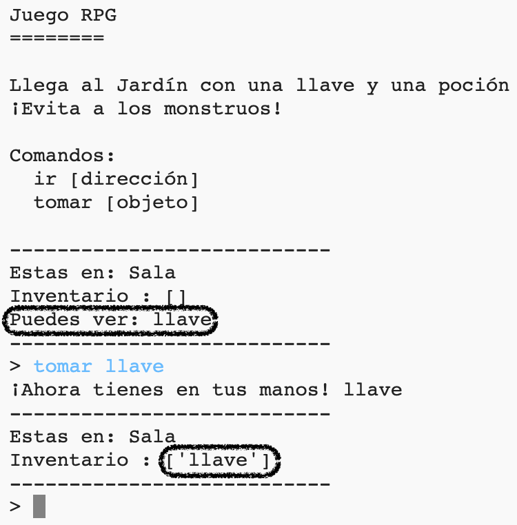

## Agregar objetos para recoger

Dejemos objetos en las habitaciones para que el jugador los recoja a medida que se mueve por el laberinto.

\--- task \---

Agregar un objeto a una habitación es fácil, simplemente agrégalo al diccionario de la habitación. Pongamos una llave en la sala.

Recuerda poner una coma después de la línea de objeto nuevo, ¡o tu programa no va a funcionar!

## \--- code \---

language: python

## line_highlights: 6-7

# un diccionario que conecte una habitación con las otras habitaciones

rooms = {

            'Hall' : {
                'south' : 'Kitchen',
                'east' : 'Dining Room',
                'item' : 'key'
            },
    
            'Kitchen' : {
                'north' : 'Hall'
            },
    
            'Dining Room' : {
                'west' : 'Hall'
            }
    
        }
    

\--- /code \---

\--- /task \---

\--- task \---

Si ejecutas tu programa después de añadir el código de arriba, vas a poder ver una llave en la sala, e incluso podrás cogerla (al escribir `get key`) (coger la llave) lo que la añadirá a tu inventario!

\--- /task \---