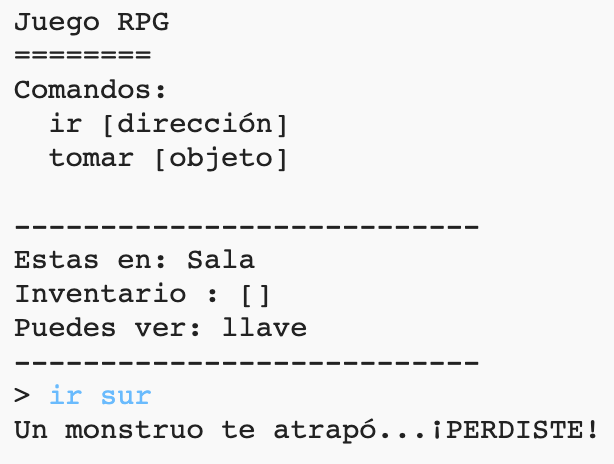

## Añadir enemigos

¡Este juego es muy fácil! Agreguemos enemigos a algunas habitaciones que el jugador deberá evitar.

--- task ---

Añadir un enemigo a una habitación es tan fácil como agregar cualquier otro objeto. Añadamos un monstruo hambriento a la cocina:

--- code ---
---
language: python
line_highlights: 11-12
---
# un diccionario que conecte una habitación con las otras habitaciones
habitaciones = {

        'Sala': {
            'sur': 'Cocina',
            'este': 'Comedor',
            'objeto': 'llave'
        },
    
        'Cocina': {
            'norte': 'Sala',
            'objeto': 'monstruo'
        },
    
        'Comedor': {
            'oeste': 'Sala'
        }
    
    
    }
    

--- /code ---

--- /task ---

--- task ---

También debes asegurarte de que el juego termine si el jugador entra a una habitación que contiene un monstruo. Puedes hacerlo con el siguiente código, que debe añadirse al final del juego:

--- code ---
---
language: python
line_highlights: 6-9
---
    #Por el contrario, si el objeto que se quiere no esta en la habitación
    else:
        #diles que no pueden cogerlo
        print('¡No puedes tomarlo' + movimiento[1] + '!')
    
    #el jugador pierde si entra en una habitación con un monstruo
    if 'objeto' in habitaciones[habitacionActual] and 'monstruo' in habitaciones[habitacionActual]['objeto']:
        print('Un monstruo te atrapó... ¡PERDISTE!')
        break
    

--- /code ---

Este código verifica si hay un objeto en la habitación, y en caso afirmativo, si ese objeto es un monstruo. Ten en cuenta que el código tiene sangría, poniéndolo en línea con el código anterior. Esto significa que en el juego se verificará si hay un monstruo cada vez que el jugador entre a una nueva habitación.

--- /task ---

--- task ---

Prueba tu código al ir a la cocina que ahora contiene un monstruo.

--- /task ---