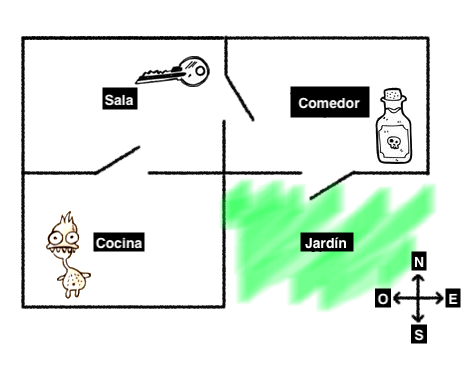
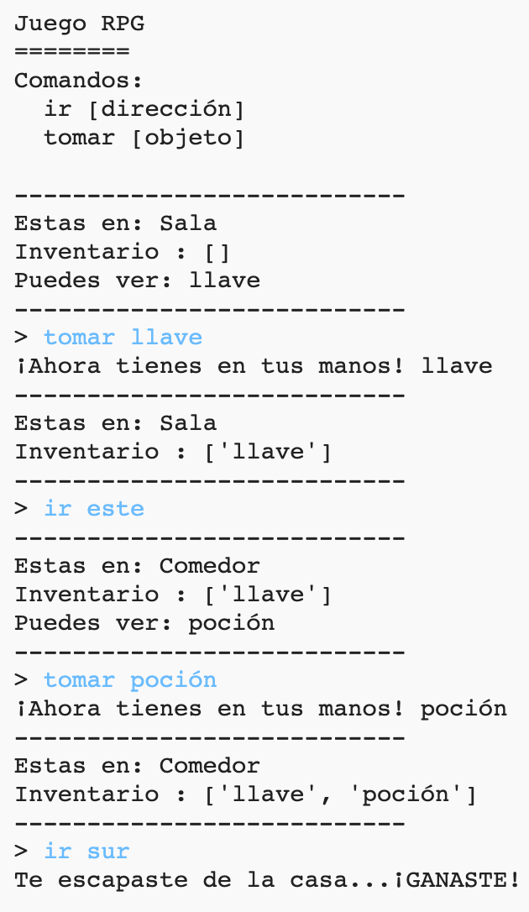
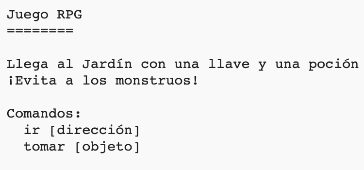

## Ganar el juego

Demos a tu jugador una misión que necesite completar para ganar el juego.

\--- task \---

En este juego, el jugador gana al llegar al jardín y escapar de la casa. También van a necesitar tener una llave y una poción mágica con ellos. Aquí hay un mapa del juego.

\--- /task \---

\--- task \---

Primero, necesitas agregar un jardín al sur del comedor. Recuerda añadir puertas, para conectarlo a otras habitaciones de la casa.

## \--- code \---

language: python

## line_highlights: 16-17,18-22

# un diccionario que conecte una habitación con las otras habitaciones

rooms = {

            'Hall' : {
                'south' : 'Kitchen',
                'east' : 'Dining Room',
                'item' : 'key'
            },
    
            'Kitchen' : {
                'north' : 'Hall',
                'item' : 'monster'
            },
    
            'Dining Room' : {
                'west' : 'Hall',
                'south' : 'Garden'
            },
    
            'Garden' : {
                'north' : 'Dining Room'
            }
    
        }
    

\--- /code \---

\--- /task \---

\--- task \---

Agrega una poción al comedor (u otra habitación de tu casa).

## \--- code \---

language: python

## line_highlights: 3-4

            'Dining Room' : {
                'west' : 'Hall',
                'south' : 'Garden',
                'item' : 'potion'
            },
    

\--- /code \---

\--- /task \---

\--- task \---

Agrega este código para dejar que el jugador gane cuando llegue al jardín con la llave y la poción:

## \--- code \---

language: python

## line_highlights: 6-9

# el jugador pierde si entra a una habitación con un monstruo

if 'item' in rooms\[currentRoom] and 'monster' in rooms[currentRoom\]\['item'\]: print('A monster has got you... GAME OVER!') break

# el jugador gana si llega al jardín con una llave y una poción

if currentRoom == 'Garden' and 'key' in inventory and 'potion' in inventory: print('You escaped the house... YOU WIN!') break

\--- /code \---

Asegúrate de que el código tiene sangría, al estar en línea con el código anterior. Este código significa que el mensaje `You escaped the house...YOU WIN!` (Has escapado de la casa... HAS GANADO!) si el jugador está en la habitación 4 (el jardín) y si la llave y la poción están en su inventario.

Si tienes más de 4 habitaciones, puedes utilizar un número diferente para tu jardín en el código anterior.

\--- /task \---

\--- task \---

¡Prueba tu juego para asegurarte de que el jugador puede ganar!

\--- /task \---

\--- task \---

Finalmente, agreguemos instrucciones al juego, de ese modo el jugador sabe qué tiene que hacer. Edita la función `showInstructions()` para incluir más información.

## \--- code \---

language: python

## line_highlights: 7-8

def showInstructions(): #print a main menu and the commands print('''

# Juego RPG

Llega al jardín con una llave y una poción. ¡Evita a los monstruos!

Commands: go [direction] get [item] ''')

\--- /code \---

¡Vas a necesitar añadir instrucciones para decirle al usuario qué objetos necesitan recoger y qué necesitan evitar!

\--- /task \---

\--- task \---

Prueba tu juego y ve tus nuevas instrucciones.

\--- /task \---