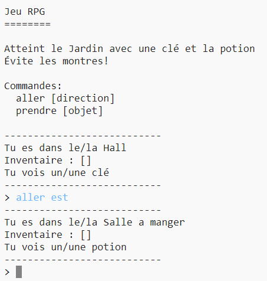

## Introduction :

Dans ce projet, tu vas concevoir et coder ton propre jeu de labyrinthe RPG. Le but du jeu sera de collecter des objets et de s'échapper d'une maison, en s'assurant d'éviter tout les montres!

## Ce que tu feras

--- no-print ---

Tape `aller` et ensuite une direction (nord, est, sud ou ouest) pour te déplacer dans le monde (ex: `aller nord`).

Tape `prendre` pour ramasser des objets que tu vois (ex `prendre clé`).

  <iframe src="https://trinket.io/embed/python/1bea9bd489?outputOnly=true&start=result" width="600" height="500" frameborder="0" marginwidth="0" marginheight="0" allowfullscreen>
  </iframe>
  

--- /no-print ---

--- print-only ---

--- /print-only ---

--- collapse ---
---
title: Ce que tu auras besoin
---
### Matériel informatique

+ Un ordinateur capable d'exécuter Python

### Logiciel

+ Python 3 (soit [en ligne](https://trinket.io/){:target="_blank"} ou [hors ligne](https://www.python.org/downloads/){:target="_blank"})

### Téléchargements

Le projet de démarrage peut être trouvé [ici](http://rpf.io/p/fr-FR/rpg-go){:target="_blank"}.

--- /collapse ---

--- collapse ---
---
title: Ce que tu vas apprendre
---
+ Conception de jeux;
+ Édition: 
    + Listes;
    + Dictionnaires.
+ Expressions booléennes.

Ce projet couvre les éléments suivants du [Programme Raspberry Pi de Créativité Numérique](http://rpf.io/curriculum) :

+ [Combine des constructions de programmation pour résoudre un problème.](https://www.raspberrypi.org/curriculum/programming/builder)

--- /collapse ---

--- collapse ---
---
title: Informations supplémentaires pour les éducateurs
---
Si vous avez besoin d'imprimer ce projet, merci d'utiliser la [Version imprimable](https://projects.raspberrypi.org/fr-FR/projects/rpg/print).

Vous pouvez [trouver la solution pour ce projet ici](http://rpf.io/p/fr-FR/rpg-get){:target="_blank"}.

--- /collapse ---