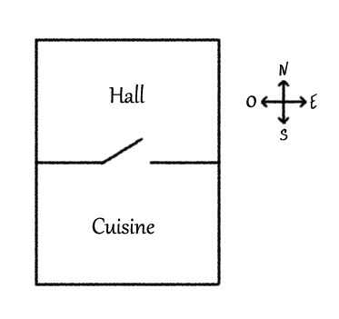
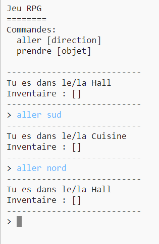
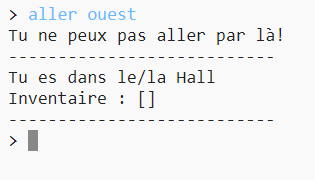
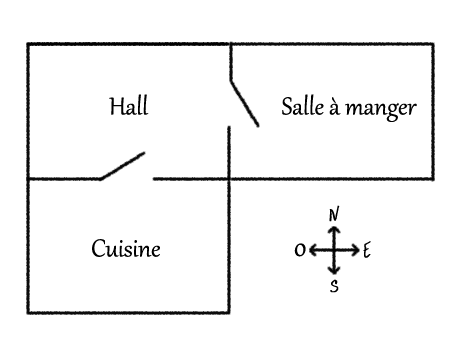
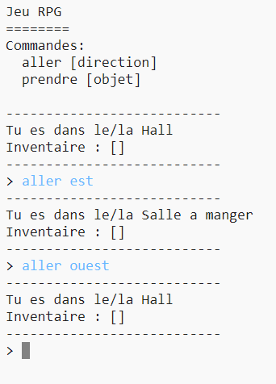

## Ajouter de nouvelles pièces

--- task ---

Ouvre le projet de démarrage Python.

**En ligne**: ouvre le projet de démarrage à [trinket.io/python/0a0b684a31](https://trinket.io/python/0a0b684a31){:target="_blank"}.

**Hors ligne**: ouvre le [projet de démarrage](http://rpf.io/p/fr-FR/rpg-go){:target="_blank"} dans l'éditeur hors ligne.

--- /task ---

--- task ---

Ceci est une version basique du jeu RPG qui a seulement 2 pièces. Voici un plan du jeu :

Tu peux taper `aller sud` pour te déplacer du hall à la cuisine, et ensuite `aller nord` pour revenir au hall !

--- /task ---

--- task ---

Que ce passe t-il lorsque tu tapes dans une direction que tu ne peux pas aller ? Tape `aller ouest` dans le hall et tu auras un joli message d'erreur.

--- /task ---

--- task ---

Si tu trouves la variable `rooms` , tu peux voir que le plan est codé en tant que dictionnaire des pièces :

--- code ---
---
language: python
---
# un dictionnaire liant une pièce à d'autres pièces
rooms = {

            'Hall' : {
                'sud' : 'Cuisine'
            },
    
            'Cuisine' : {
                'nord' : 'Hall'
            }
    
        }
--- /code ---

Chaque pièce est un dictionnaire, et les pièces sont liées ensemble utilisant les directions.

--- /task ---

--- task ---

Ajoutons une salle à manger au plan, à l'est du hall.

Tu dois ajouter une troisième pièce, appelée la `salle a manger`, et la lier au hall (à l'ouest). Tu as besoin également d'ajouter des données au hall, de sorte que tu puisses te déplacer vers la salle à manger à l'est.

**N'oublie pas que tu auras besoin également d'ajouter des virgules aux lignes devant ton nouveau code.**

--- code ---
---
language: python
line_highlights: 5-6,11-15
---
# un dictionnaire liant une pièce à d'autres pièces
rooms = {

            'Hall' : {
                'sud' : 'Cuisine',
                'est' : 'Salle a manger'
            },
    
            'Cuisine' : {
                'nord' : 'Hall'
            },
    
            'Salle a manger' : {
                'ouest' : 'Hall'
            }
    
        }
--- /code ---

--- /task ---

--- task ---

Essaie le jeu avec ta nouvelle salle à manger :

Si tu ne peux pas te déplacer à l'intérieur et à l'extérieur de la salle à manger, vérifie simplement que tu as ajouté tout le code du dessus (incluant les virgules supplémentaires aux lignes au dessus).

--- /task ---