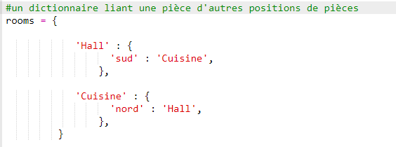

## Ajouter de nouvelles pièces

+ Une partie du code pour ce jeu a été déjà mis à ta disposition. Ouvre ce trinket : <a href="http://jumpto.cc/rpg-go" target="_blank">jumpto.cc/rpg-go</a>.

+ Ceci est un jeu de rôle assez simple qui contient seulement 2 pièces. Il y a un plan du jeu :

  

  Tu peux taper `go south` pour te déplacer du couloir dans la cuisine, puis `go north` pour retourner dans le couloir !

  

+ Que se passe-t-il quand tu tapes une direction dans laquelle tu ne peux pas te déplacer ? Tape `go west` dans le couloir et tu recevras un joli petit message d'erreur.

  

+ Si tu trouves la variable `rooms`, tu peux voir que le plan est codé comme un dictionnaire de pièces :

  

  Chaque pièce est un dictionnaire et les pièces se sont raccordées avec les directions.   

+ Ajoutons une salle à manger à notre plan, à l'est du couloir.

  

  Tu as besoin d'ajouter une 3ème pièce, qui s'appelle `dining room` (salle à manger). Tu as également besoin de la relier au couloir à l'ouest. Tu dois aussi ajouter des données au couloir, pour pouvoir te déplacer dans la salle à manger vers l'est.

  

+ Essaie le jeu avec ta nouvelle salle à manger :

  

  Si tu n'arrives pas à entrer et sortir de la salle à manger, vérifie simplement que tu as bien ajouté tout le code ci-dessus (y compris les virgules supplémentaires dans les lignes ci-dessus).
