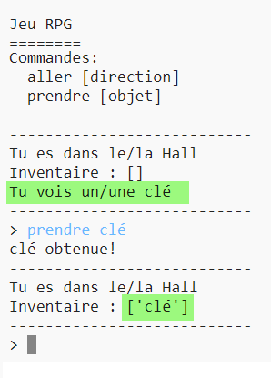

## Ajoute des objets à collecter

Laissons les objets dans les pièces pour que le joueur les collecte au fur et à mesure qu'il avance dans le labyrinthe.

--- task ---

Ajouter un objet dans une pièce est facile, tu peux simplement l'ajouter au dictionnaire de pièce. Mettons une clé dans le hall.

N'oublie pas d'ajouter une virgule après la ligne au dessus du nouvel objet, ou alors ton programme ne fonctionnera pas !

--- code ---
---
language: python
line_highlights: 6-7
---
# un dictionnaire liant une pièce à d'autres pièces
rooms = {

            'Hall' : {
                'sud' : 'Cuisine',
                'est' : 'Salle a manger',
                'objet' : 'clé'
            },
    
            'Cuisine' : {
                'nord' : 'Hall'
            },
    
            'Salle a manger' : {
                'ouest' : 'Hall'
            }
    
        }
--- /code ---

--- /task ---

--- task ---

Si tu exécutes ton jeu après avoir ajouté le code du dessus, tu peux maintenant voir une clé dans le hall, et tu peux même la ramasser (en tapant `prendre clé`) qui l'ajoute à ton inventaire !

--- /task ---