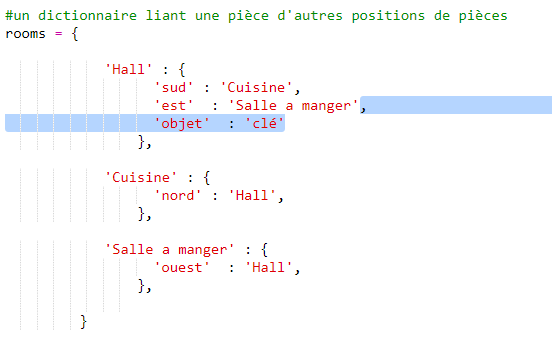

## Ajoute des articles à ramasser

Laissons traîner des articles dans les pièces pour que le joueur puisse les collectionner au fer et à mèsure qu'il se déplace dans le labyrinthe.

+ Pour ajouter des articles dans une pièce, c'est facile, il suffit de les ajouter dans le dictionnaire de la pièce. Mettons une clé dans le couloir.

  

  Pense à mettre une virgule après la ligne au-dessus du nouvel article, sinon ton code ne pourra pas s'exécuter !

+ Si tu exécutes ton jeu après avoir ajouté le code ci-dessus, tu verras désormais une clé dans le couloir, et tu pourras même la ramasser (en tapant `get key`), ce qui l'ajoute à ton inventaire !

    
