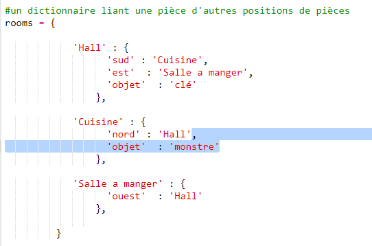
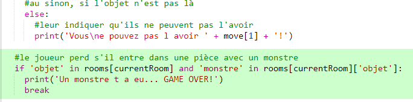

## Ajoute des adversaires

Ce jeu est trop facile ! Ajoutons des adversaires dans certaines des pièces que le joueur devrait éviter.

+ Ajouter un adversaire dans une pièce est aussi simple qu'ajouter tout autre article. Ajoutons un monstre affamé dans la cuisine :

  

+ Tu devrais aussi vérifier que le jeu se termine si le joueur entre dans une pièce qui contient un monstre. Tu peux faire ceci avec le code suivant, que tu devrais ajouter à la fin du jeu :

  

  Ce code vérifie s'il y a un article dans la pièce, et si oui, si cet article s'agit d'un monstre. À noter que ce code est décalé, pour que ça s'aligne avec le code en-dessus. Ça veut dire que le jeu vérifie s'il y a un monstre chaque fois que le joueur se déplace dans une autre pièce.

+ Teste ton code en passant dans la cuisine, qui contient désormais un monstre.

  

