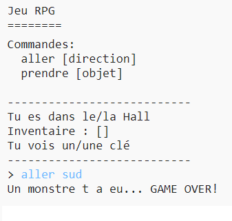

## Ajoute des adversaires

Ce jeu est trop facile! Ajoutons des adversaires à quelques unes des pièces que le joueur doit éviter.

\--- task \---

Ajouter un adversaire à une pièce est aussi facile que d'ajouter tout autre objet. Ajoutons un monstre en colère à la cuisine :

## \--- code \---

language: python

## line_highlights: 11-12

# un dictionnaire liant une pièce à d'autres pièces

rooms = {

            'Hall' : {
                'sud' : 'Cuisine',
                'est' : 'Salle a manger',
                'objet' : 'clé'
            },
    
            'Cuisine' : {
                'nord' : 'Hall',
                'objet' : 'monstre'
            },
    
            'Salle a manger' : {
                'ouest' : 'Hall'
            }
    
        }
    

\--- /code \---

\--- /task \---

\--- task \---

Tu dois t'assurer que le jeu se termine si le joueur entre dans une pièce avec un monstre à l'intérieur. Tu peux faire çà avec le code suivant, que tu devras ajouter à la fin du jeu :

## \--- code \---

language: python

## line_highlights: 6-9

        #sinon, si l'objet n'est pas là à obtenir
        else:
            #dis leur qu'ils ne peuvent pas l'obtenir
            print('Tu ne peux pas l avoir' + move[1] + '!')
    
    #le joueur perd s'ils entrent dans une pièce avec un monstre
    if 'objet' in rooms[currentRoom] and 'monstre' in rooms[currentRoom]['objet']:
        print('Un monstre t a attrapé... GAME OVER!')
        break
    

\--- /code \---

Ce code vérifie s'il y a un objet dans la pièce, et si l'objet est un monstre. Note que ce code est indenté, mets le dans une ligne avec le code ci-dessus. Cela signifie que le jeu vérifiera le monstre à chaque fois que le joueur se déplace dans une nouvelle pièce.

\--- /task \---

\--- task \---

Teste ton code en allant à la cuisine, qui contient maintenant un monstre.

\--- /task \---