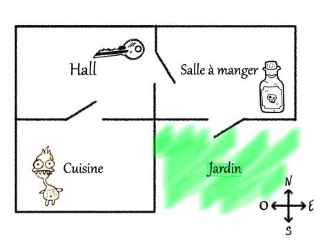
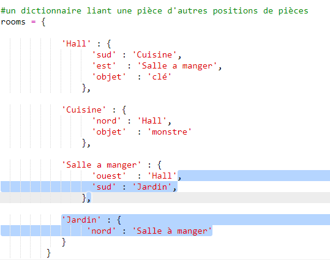
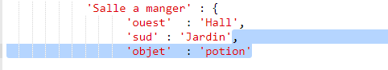
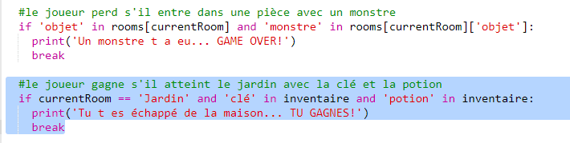
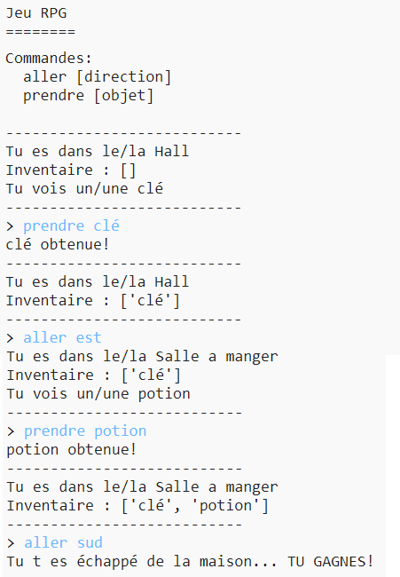
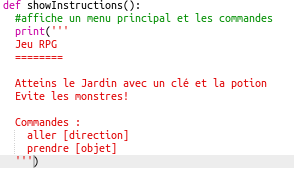
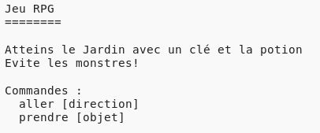

## Pour gagner le jeu

Donnons une mission à ton joueur, qui doit être réalisée afin de completer le jeu.

+ Dans le jeu, le joueur gagne en arrivant dans le jardin ainsi s'échappant de la maision. Ils ont aussi besoin d'avoir en leur possession la clé, et la potion magique. Voici un plan du jeu.

  

+ D'abord, tu auras besoin d'ajouter un jardin au sud de la salle à manger. Pense à ajouter les portes, pour la relier avec les autres pièces de la maison.

  

+ Ajoute une potion dans la salle à manger (ou dans une autres pièce de la maison).

  

+ Ajoute ce code afin de permettre au joueur de gagner le jeu quand il arrive dans le jardin avec la clé et la potion magique :

  

  Vérifie que le code soit correctement décalé, bien aligné avec le code en-dessus. Ce code signifie que le message `You escaped the house...YOU WIN!` sera affiché si le joueur est dans pièce numéro 4 (le jardin) et si la clé et la potion sont bien présentes dans l'inventaire.

  Si tu as plus de 4 pièces, tu auras peut-être besoin d'utiliser un autre chiffre pour ton jardin dans le code ci-dessus.

+ Teste ton jeu pour vérifier que ton joueur peut bien gagner !

  

+ Enfin, ajoutons quelques instructions à ton jeu, pour que le joeur sache quoi faire. Édite la fonction `showInstructions()` pour inclure d'autres informations.

  

  Tu auras besoin d'ajouter des instructions afin de dire à l'utilisateur quels articles qu'ils doivent collectionner, et ceux qu'ils doivent éviter à tout prix !

+ Teste ton jeu et tu devrais voir tes nouvelles instructions.

  
