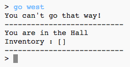
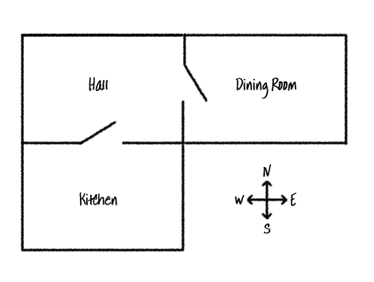

## नए कमरे जोड़ना

--- task ---

Python स्टार्टर प्रोजेक्ट खोलें।

**ऑनलाइन**: स्टार्टर प्रोजेक्ट को [rpf.io/rpgon](http://rpf.io/rpgon){:target="_blank"} पर खोलें।

**ऑफलाइन**:[ स्टार्टर प्रोजेक्ट](http://rpf.io/p/hi-IN/rpg-go){:target="_blank"} को ऑफलाइन एडिटर में खोलिये।

--- /task ---

--- task ---

यह एक बहुत ही मूल आरपीजी खेल है जिसमें केवल 2 कमरे हैं। यह खेल का एक नक्शा है:

आप `go south` टाइप करके hall से kitchen में जा सकते हैं, और फिर `go north` टाइप करके वापस hall में आ सकते हैं!

--- /task ---

--- task ---

क्या होगा जब आप एक ऐसी दिशा टाइप करते है जहाँ आप नही जा सकते? टाइप `go west` जब आप hall में हो और आपको एक एरर संदेश मिलेगा।

--- /task ---

--- task ---

अगर आप `rooms` variable को ढूंढे, तो आप देख सकते हैं की नक्शे को rooms की dictionary की तरह कोड किया गया है|

--- code ---
---
language: python
---
#a dictionary linking a room to other rooms
rooms = {

            'Hall' : {
                'south' : 'Kitchen'
            },

            'Kitchen' : {
                'north' : 'Hall'
            }

        }
--- /code ---

प्रत्येक कमरा एक dictionary है और एक दूसरे से दिशाओं के द्वारा जुड़े हुए हैं|

--- /task ---

--- task ---

hall के east में एक dining room को जोड़ते हैं|

आपको एक तीसरा कमरा, जिसे `dining room` कहा जायेगा, hall से जोड़ना होगा (west दिशा में)। आपको hall में डेटा डालने की भी आवश्यकता है, ताकि आप dining room से east दिशा की तरफ जा सकें।

**मत भूलो कि आपको अपने नए कोड से पहले लाइनों में कॉमा(,) जोड़ना होगा।**

--- code ---
---
language: python
line_highlights: 5-6,11-15
---
#a dictionary linking a room to other rooms
rooms = {

            'Hall' : {
                'south' : 'Kitchen',
                'east' : 'Dining Room'
            },

            'Kitchen' : {
                'north' : 'Hall'
            },

            'Dining Room' : {
                'west' : 'Hall'
            }

        }
--- /code ---

--- /task ---

--- task ---

अपने नए dining room के साथ खेल को आज़माएं:

यदि आप dining room से अंदर और बाहर नहीं जा सकते हैं, तो बस चेक करें कि आपने ऊपर दिए गए सभी कोड जोड़े हैं (अतिरिक्त कॉमा को लाइनों के लिए सहित)।

--- /task ---