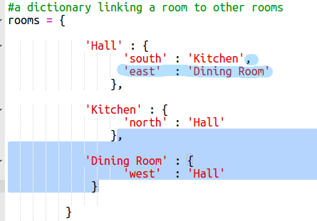

## नए कमरे जोड़ना

+ इस गेम के लिए आपको कुछ कोड प्रदान किए गए हैं। यह ट्रिंकेट लिखें: <a href="http://jumpto.cc/rpg-go" target="_blank">jumpto.cc/rpg-go</a>. 

+ यह बिल्कुल बुनियादी RPG गेम है जिसमें केवल 2 कमरे हैं। गेम का मानचित्र इस प्रकार है:

  

  हॉल से रसोईघर में जाने के लिए आप `go south` (दक्षिण जाएँ) टाइप कर सकते हैं, और वापस हॉल में जाने के लिए `go north` (उत्तर जाएँ) टाइप कर सकते हैं!

  

+ क्या होता है यदि आप ऐसी दिशा टाइप करते हैं, जहाँ आप जा नहीं सकते? हॉल में `go west` (पश्चिम जाएँ) टाइप करें और आपको मैत्रीपूर्ण त्रुटि संदेश प्राप्त होगा।

  

+ यदि आप `rooms` वेरिएबल को ढूँढ़ लेते हैं, तो आप देख सकते हैं कि मानचित्र को कमरों की डिक्शनरी के रूप में कोड किया गया है:

  

  प्रत्येक कमरा डिक्शनरी है और कमरे एक दूसरे के साथ दिशाओं द्वारा जुड़े हैं।  
  

+ चलिए अपने हॉल के पूर्व में मानचित्र में डाइनिंग रूम जोड़ें।

  

  आपको `dining room` (डाइनिंग रूम) नामक तीसरा कमरा जोड़ना चाहिए। आपको इसे पश्चिम में हॉल से भी जोड़ना चाहिए। आपको हॉल में डेटा भी जोड़ना चाहिए, ताकि आप पूर्व में डाइनिंग रूम तक जा सकें।
  
  

+ अपने नए डाइनिंग रूम के साथ गेम का परीक्षण करें:

  

  यदि आप डाइनिंग रूम के अंदर या बाहर नहीं जा पा रहे, तो बस यह देखें कि क्या आपने ऊपर पूरा कोड (अतिरिक्त कॉमा से उपर्युक्त पंक्तियों तक) शामिल किया है।

