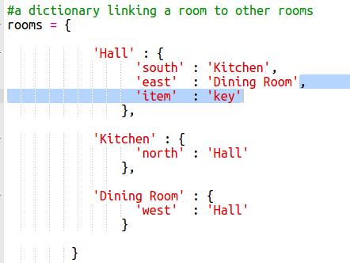

## एकत्र करने के लिए आइटम्स जोड़ना

चलिए भूल भुलैया में आगे बढ़ने के साथ खिलाड़ी द्वारा आइटम्स को एकत्र करने के लिए उन्हें ऐसे ही छोड़ दें।

+ कमरे में कोई आइटम जोड़ना आसान है, आप बस इसे कमरे की डिक्शनरी में जोड़ सकते हैं। चलिए हॉल में कुंजी जोड़ें।

  

  नए आइटम के ऊपर पंक्ति के आगे कॉमा जोड़ना न भूलें, अन्यथा आपका प्रोग्राम रन नहीं होगा!

+ यदि आप उपर्युक्त कोड शामिल करने के बाद गेम को रन करते हैं, तो आप हॉल में शामिल कुंजी देख सकते हैं, यहाँ तक कि आप इसे उठा भी सकते हैं (`get key` (द्वार कुंजी) टाइप करके) जो इसे आपकी इनवेंटरी में जोड़ देटा है!

    

