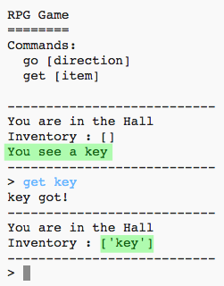

## एकत्र करने के लिए आइटम्स जोड़ना

अब कुछ आइटम्स(item) को कमरे में छोड़ देते हैं, जिन्हे खिलाड़ी इक्कठा करेगा जब वो भूलभुलैया में जायेगा|

\--- task \---

एक कमरे में एक आइटम जोड़ना आसान है, आप इसे कमरे की dictionary में जोड़ सकते हैं। अब हॉल में चाबी रखते हैं।

नए आइटम के ऊपर लाइन के बाद कॉमा लगाना याद रखें, अथवा आपका प्रोग्राम नहीं चलेगा!

## \--- code \---

language: python

## line_highlights: 6-7

# a dictionary linking a room to other rooms

rooms = {

            'Hall' : {
                'south' : 'Kitchen',
                'east' : 'Dining Room',
                'item' : 'key'
            },
            'Kitchen' : {
                'north' : 'Hall'
            },
            'Dining Room' : {
                'west' : 'Hall'
            }
        }
    

\--- /code \---

\--- /task \---

\--- task \---

यदि आप ऊपर दिए गए कोड को जोड़ने के बाद अपना गेम चलाते हैं, तो आप अब hall में एक key देख सकते हैं, और आप इसे उठा भी सकते हैं (टाइप करके `get key`) जो इसे आपकी सूची में जोड़ता है!

\--- /task \---