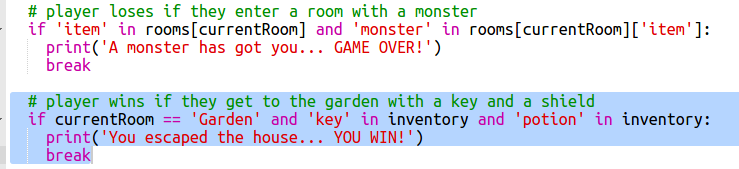

## गेम जीतना

चलिए अपने खिलाड़ी को मिशन दें, जिसे गेम जीतने के लिए पूरा करना होगा।

+ इस गेम में, गार्डन में आने और घर से भागने पर खिलाड़ी जीत जाता है। उन्हें अपने साथ कुंजी और जादुई शरबत भी रखना होता है। गेम का मानचित्र इस प्रकार है।

  

+ सबसे पहले, आपको डाइनिंग रूम के दक्षिण में गार्डन जोड़ना होगा। घर में अन्य कमरों से जोड़ने के लिए दरवाज़े जोड़ना याद रखें।
  
  

+ डाइनिंग रूम (या घर के अन्य कमरे) में शरबत जोड़ें।

  
  
+ खिलाड़ी द्वारा गार्डन में कुंजी और शरबत ले जाने पर उसे जीनते देने के लिए यह कोड जोड़ें:

  

  यह सुनिश्चित करें कि इस कोड में इसके ऊपर के कोड के साथ पंक्ति में हाशिया छोड़ा जाए। इस कोड का अर्थ है कि यदि खिलाड़ी कमरा 4 (गार्डन) में पहुँचता है तो `You escaped the house...YOU WIN!` (आप घर से बच निकले...आप जीत गए हैं!) संदेश दिखाई देता है, और यदि कुंजी और शरबत इनवेंटरी में शामिल हैं।
  
  यदि 4 से अधिक कमरे हों, तो आपको उपर्युक्त कोड में गार्डन के लिए अन्य संख्या उपयोग करनी चाहिए।

+ खिलाड़ी का जीत पाना सुनिश्चित करने के लिए अपनी गेम का परीक्षण करें!

  

+ अंत में, अपनी गेम में कुछ निर्देश जोड़ें, ताकि खिलाड़ी जान सके कि उसे क्या करना है। अधिक जानकारी शामिल करने के लिए `showInstructions()` फंक्शन को संपादित करें।

  

  आपको उपयोगकर्ता को यह बताने के लिए निर्देश शामिल करने चाहिए कि उन्हें कौन से आइटम्स एकत्र करने हैं, और कौन से नहीं!

+ अपनी गेम का परीक्षण करें और आपको अपने नए निर्देश दिखने चाहिए
  
  

