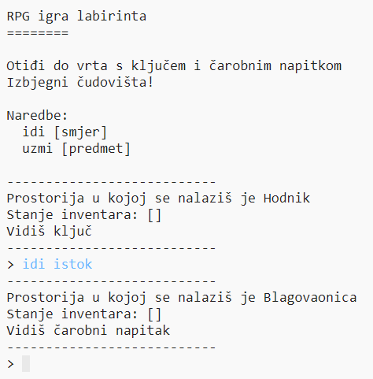

## Uvod
U ovom projektu dizajnirat ćeš i napraviti vlastitu RPG igru labirinta. Cilj igre je skupiti sve objekte i pobjeći iz kuće, izbjegavajući pri tome sva čudovišta!

## Što ćete napraviti

--- no-print ---

Natipkajte `idi` i onda smjer (sjever, istok, jug ili zapad) za kretanje svijetom (e.g. `idi sjever`).

Natipkajte `uzmi` da pokupite bilo koji predmet koji vidite (e.g. `uzmi ključ`).

  <iframe src="https://trinket.io/embed/python/a46955de37?outputOnly=true&start=result" width="600" height="500" frameborder="0" marginwidth="0" marginheight="0" allowfullscreen>
  </iframe>
  

--- /no-print ---

--- print-only ---

--- /print-only ---

--- collapse ---
---
title: Trebat ćeš
---
### Hardver

+ Računalo koje može pokrenuti Python

### Softver

+ Python 3 ([online](https://trinket.io/){:target="_blank"} ili [offline](https://www.python.org/downloads/){:target="_blank"} verziju)

### Preuzimanja

Početni projekt možete pronaći [ovdje](https://rpf.io/p/hr-HR/rpg-go){:target="_blank"}.

--- /collapse ---

--- collapse ---
---
title: Naučit ćeš
---
+ Dizajn igre;
+ Uređivanje: 
    + Liste;
    + Rječnici.
+ Boolean izrazi.

Ovaj projekt obuhvaća elemente iz sljedećih dijelova [Raspberry Pi Digital Making Curriculum](https://rpf.io/curriculum) nastavnog plana i programa:

+ [Koristi različite programske strukture za rješavanje problema.](https://www.raspberrypi.org/curriculum/programming/builder)

--- /collapse ---

--- collapse ---
---
title: Dodatne informacije za edukatore
---
Ako želite ispisati ovaj projekt, molimo Vas da koristite [verziju koja je prilagođena za ispis](https://projects.raspberrypi.org/hr-HR/projects/rpg/print).

Dovršen projekt možete pronaći [ovdje](https://rpf.io/p/hr-HR/rpg-get){:target="_blank"}.

--- /collapse ---