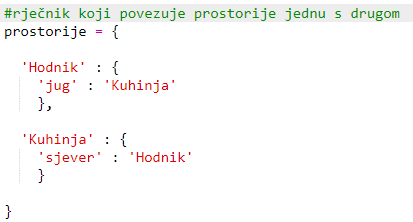
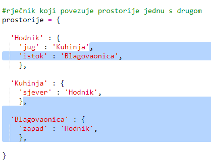

## Dodavanje novih prostorija

+ Dio kôda za ovu igru smo ti već pripremili. Otvori ovaj trinket: <a href="http://jumpto.cc/rpg-go" target="_blank">jumpto.cc/rpg-go</a>.

+ Ovo je vrlo jednostavna RPG igra koja se sastoji od samo dvije prostorije. Ispod se nalazi nacrt igre:
    
    
    
    Upiši `idi jug` za pomicanje iz hodnika u kuhinju, a zatim `idi sjever` za povratak u hodnik!
    
    

+ Što se dogodi kada upišeš smjer u kojem ne možeš ići? Upiši `idi zapad` dok si u hodniku i dobit ćeš simpatičnu poruku o grešci.
    
    

+ Pronađi varijablu `prostorije` i vidjet ćeš da je nacrt kodiran u obliku rječnika prostorija:
    
    
    
    Svaka prostorija je jedan rječnik, a prostorije su međusobno povezane smjerovima.

+ Dodajmo istočno od hodnika blagovaonicu.
    
    
    
    Moraš dodati treću prostoriju koju ćeš nazvati `blagovaonica`. Također ju moraš povezati sa hodnikom na zapadu. Moraš dodati i podatke prostoriji hodnik u rječniku kako bi bilo moguće pomicati se u blagovaonicu na istoku.
    
    

+ Isprobaj igru sad kad si dodao blagovaonicu:
    
    
    
    Ako se ne možeš pomicati u blagovaonicu i iz nje, provjeri jesi li dodao sav kôd koji se nalazi iznad (uključujući i dodatne zareze u linijama).